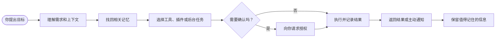
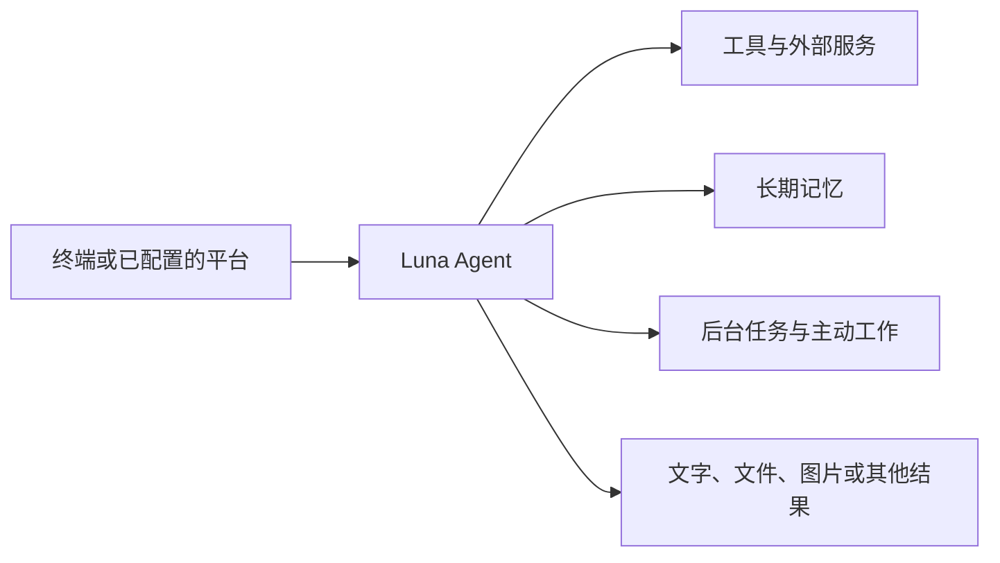

<div align="center">

<h1>Luna Agent</h1>

<p><strong>一个能长期替你做事的私人 Agent</strong></p>

<p>
  会记住你、使用工具、处理任务、主动工作，<br>
  并在你的授权范围内不断扩展能力。
</p>

<p>
  
  <a href="https://github.com/sjs126y/luna-agent/actions/workflows/ci.yml"></a>
  
  
</p>

<p>
  <a href="#快速开始">快速开始</a> ·
  <a href="#核心亮点">核心亮点</a> ·
  <a href="docs/README.md">文档中心</a> ·
  <a href="docs/capabilities-and-boundaries.md">能力与边界</a> ·
  <a href="docs/plugins.md">插件开发</a>
</p>

</div>

---

Luna Agent 不只是一个等待你提问的聊天窗口。它可以长期运行，理解你的上下文，调用合适的工具完成工作，把结果交付给你，并在之后继续记得重要信息。

它能做什么，取决于当前拥有的工具和插件，而不是固定在一组聊天功能里。只要有对应能力，它就可以查询信息、处理文件、运行任务、编写代码、观察工作区，或者完成一整套自动化流程。

## 核心亮点

<table>
  <tr>
    <td width="50%" valign="top">
      <h3>安全地替你做事</h3>
      <p>重要操作可以先询问你，文件、命令、网络和个人信息都有清晰的授权边界。每次工具调用、拒绝和结果都可以追溯，插件也不会直接和主程序混在一起。</p>
    </td>
    <td width="50%" valign="top">
      <h3>能力几乎没有固定上限</h3>
      <p>给它一个工具，它就能多做一类工作；接入一个插件，它就能获得一组新的能力。工具、服务和工作流程可以按你的需要组合起来。</p>
    </td>
  </tr>
  <tr>
    <td valign="top">
      <h3>增加能力时不用停机</h3>
      <p>插件可以在运行中更新、重新加载和回到上一版本。插件出错时，影响范围会被限制在自己的运行环境里，不会拖垮整个 Agent。</p>
    </td>
    <td valign="top">
      <h3>可以连接 Codex 一起开发</h3>
      <p>你可以让 Codex 协助创建、编写、测试和打包新的插件，把“想增加一个能力”变成一条可以持续迭代的工作流程。</p>
    </td>
  </tr>
  <tr>
    <td valign="top">
      <h3>会随着使用积累记忆</h3>
      <p>它不只保存聊天记录，还能整理你的偏好、项目背景、重要决定和长期目标，并在后续工作中找回真正有用的信息。</p>
    </td>
    <td valign="top">
      <h3>不需要等你每次提醒</h3>
      <p>它可以执行提醒、定时任务、收件箱处理和工作区观察，在有变化时再把结果带回正式会话。</p>
    </td>
  </tr>
  <tr>
    <td valign="top">
      <h3>能看见自己正在发生什么</h3>
      <p>运行状态、会话进度、记忆维护、插件状态和错误原因都有独立的观察入口，排查问题时不必只猜测发生了什么。</p>
    </td>
    <td valign="top">
      <h3>从一个入口持续工作</h3>
      <p>终端对话、已配置的平台、后台任务和主动事件使用同一套会话、工具、记忆和交付能力，不需要为每种入口重新设计一个助手。</p>
    </td>
  </tr>
</table>

## 它怎样完成一件事



一次任务可以只是回答问题，也可以跨越多个工具、文件和后台步骤。执行过程中可以查看进度、停止任务，或者根据新的信息继续修正方向。

## 你可以让它做什么

| 目标 | 示例 |
| --- | --- |
| 处理项目 | 检查仓库改动、分析风险、运行测试、整理报告 |
| 使用信息 | 查询资料、阅读网页、比较文档、提取长文档内容 |
| 管理文件 | 读取和整理文件，生成文档、表格、图片或其他结果 |
| 编写代码 | 设计功能、修改代码、验证结果，并通过 Codex 协助开发插件 |
| 自动执行 | 设置提醒、运行定时任务、观察工作区或处理收件箱 |
| 连接服务 | 按需接入 GitHub、浏览器、文档服务和其他外部工具 |
| 长期协作 | 记住你的偏好、项目背景、决定和后续计划 |

## 从哪里使用

Luna Agent 可以在本地终端中使用，也可以连接已经配置好的平台。无论从哪里进入，核心的会话、工具、记忆和权限规则保持一致。



## 快速开始

需要 Python 3.12+ 和 [uv](https://docs.astral.sh/uv/)。

```bash
git clone https://github.com/sujinsheng123/luna-agent.git
cd luna-agent

uv sync
uv run luna-agent init --profile local --copy-env --fix-dirs
```

在 `.env` 中填写至少一个模型 API Key，然后检查环境并开始对话：

```bash
uv run luna-agent doctor
uv run luna-agent chat
```

需要长期运行 Gateway 时：

```bash
uv run luna-agent serve
```

模型、记忆、安全模式、MCP 和平台连接配置见[配置说明](docs/configuration.md)。

## 扩展 Luna Agent

你可以从一个小工具开始，也可以做一个完整的插件。插件能够为 Agent 增加工具、命令、知识、外部服务、自动任务和工作流程；更新时可以重新加载，失败时可以恢复，普通任务不会因为某个插件异常而全部停止。

如果你不想从零开始，可以让 Codex 协助完成插件开发流程：提出需求、生成代码、运行测试、打包安装，再由 Luna Agent 在受控环境中加载它。

开始阅读：[插件开发指南](docs/plugins.md)

## 运行状态与项目状态

遇到问题时，可以先运行：

```bash
uv run luna-agent doctor
uv run luna-agent doctor --verbose
```

项目还提供运行时、会话、记忆、插件、审计和日志等观察入口，方便确认 Agent 当前是否正常工作。

当前测试基线为 `1297 passed, 1 warning`。执行完整测试：

```bash
uv run pytest -q
```

## 继续阅读

| 想了解 | 文档 |
| --- | --- |
| Luna Agent 能做什么、不能做什么 | [功能、边界与配置化](docs/capabilities-and-boundaries.md) |
| 如何配置模型、记忆、MCP 和安全模式 | [配置说明](docs/configuration.md) |
| 如何编写、测试和安装插件 | [插件系统](docs/plugins.md) |
| 如何连接微信、QQ、Telegram、飞书 | [平台接入](docs/platforms.md) |
| 如何启动、诊断和排错 | [运维与排错](docs/operations.md) |
| 输入如何变成工具调用和回复 | [架构说明](docs/architecture.md) |
| 核心工具如何组织和按需发现 | [核心工具](docs/core-tools.md) |
| 插件架构有哪些已知问题 | [插件架构技术债](PLUGIN_ARCHITECTURE_DEBT.md) |
| 项目如何一路演进到现在 | [项目演进记录](PROJECT_EVOLUTION.md) |

---

<div align="center">
  <strong>Luna Agent</strong><br>
  一个会记住你、能替你做事、并且可以不断成长的私人 Agent。
</div>
