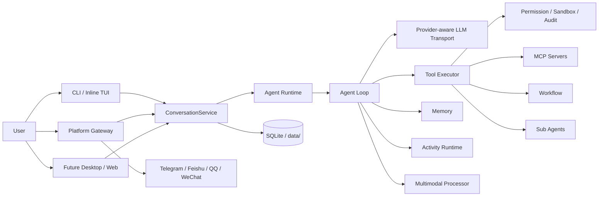

# Lumora

**Lumora is a personal AI agent runtime for tools, memory, platforms, multimodal input, and observable automation.**

Lumora 是一个插件化、多入口、可观测的个人 AI Agent runtime。它不是单轮聊天脚本，而是一套能长期运行的个人智能底座：同一个后端 runtime 同时支撑 CLI、inline TUI、平台 Gateway，以及未来的 desktop/web 客户端。

当前对外项目名是 **Lumora**；为了避免破坏现有入口，Python 包名仍是 `personal_agent`，CLI 命令仍是 `personal-agent`。

## 一眼看懂

| 你想要的能力 | Lumora 已经具备的底座 |
| --- | --- |
| 个人 AI 助手不只聊天，还能真正做事 | 工具执行、权限、安全、审计、后台进程、MCP、workflow、sub-agent 都在同一条主链路里。 |
| 多个平台共用同一个智能核心 | CLI、inline TUI、Gateway、Cron、插件和未来 desktop/web 都提交到 `ConversationCoordinator`，再复用同一 Agent Runtime。 |
| 模型调用、工具调用、后台任务都能看见 | `tool_runs`、`turn_reports`、`activity runtime`、provider cache diagnostics 和 doctor 内建。 |
| 工具调用要安全可控 | execution mode、permission policy、sandbox、path precheck、risk preview、限时授权和 audit log。 |
| 不同使用场景需要不同自动化程度 | `read-only` / `ask-first` / `local-auto` / `full-auto` 四档 mode 覆盖只读、询问优先、项目内放权和全自动。 |
| 长期运行不能靠侥幸 | Coordinator 管理会话队列，Gateway 管理平台连接，Delivery Outbox 负责持久重试和恢复。 |
| 本机环境差异要能配置 | provider、transport、context window、sandbox roots、权限策略、MCP、memory、multimodal、平台 adapter 都可配置。 |
| 后续要扩展模型、平台、工具、MCP、skill | 插件系统负责装配，核心 runtime 保持轻量，不依赖 LangChain / CrewAI 这类重框架。 |

## 为什么做它

很多 Agent 项目可以快速 demo，但一旦真正长期使用，就会遇到同一批问题：

- 模型说自己调用了工具，但实际上没有调用。
- 工具权限、安全、确认、审计散落在不同路径里。
- CLI、Bot、TUI、未来桌面端各写一套逻辑，越接越乱。
- provider、transport、缓存、context usage 语义不清。
- 后台任务、子 agent、平台连接状态出了问题看不见。
- 多模态、MCP、skill、workflow 后续扩展会挤压原本架构。

Lumora 的方向是把这些问题先放进底层 runtime 里解决，再让不同入口复用同一套能力。

## 架构概览



入口层只负责接入和展示；`ConversationService` 负责把输入转成统一会话请求；Agent Runtime 负责推理、工具、安全、记忆、多模态、状态和持久化。

## Runtime Flow

```mermaid
flowchart TB
    subgraph Entry["入口层"]
        CLI["CLI / Inline TUI"]
        Gateway["Gateway / Platform Adapters"]
        Desktop["Future Desktop / Web"]
    end

    subgraph Bootstrap["启动与装配"]
        Settings["Settings / ConfigLoader"]
        AppRuntime["create_app_runtime"]
        AgentRuntime["create_agent_runtime"]
        Plugins["PluginManager"]
    end

    subgraph Conversation["会话层"]
        Coordinator["ConversationCoordinator"]
        ActiveTurns["ActiveTurnRegistry"]
        Service["ConversationService"]
        Commands["ConversationCommandRuntime"]
        Sessions["SessionStore"]
        Directory["SessionDirectory"]
        Delivery["DeliveryService"]
        Input["ConversationInput"]
    end

    subgraph InputLayer["输入与附件"]
        Text["Text Message"]
        PlatformParts["Platform Message Parts"]
        Attachments["AttachmentRef"]
        AttachmentStore["AttachmentStore"]
        Multi["MultiAttachmentProcessor"]
    end

    subgraph AgentCore["Agent 核心"]
        Context["build_turn_context"]
        Memory["Memory Prefetch"]
        Skills["Skill Injection"]
        Planner["Request Planning"]
        Loop["run_conversation"]
        Steer["SteerManager"]
        Reports["TurnReportRecorder"]
    end

    subgraph LLM["Provider / Transport"]
        Provider["ProviderProfile"]
        Registry["Transport Registry"]
        Anthropic["Anthropic Messages"]
        Chat["Chat Completions"]
        Responses["Responses / Codex Responses"]
        Cache["Cache Diagnostics / Usage"]
    end

    subgraph Tools["工具执行"]
        ToolRegistry["ToolRegistry"]
        Executor["ToolExecutor"]
        Guard["ExecutionGuard"]
        Permission["PermissionManager"]
        Sandbox["Sandbox / Path Safety"]
        Audit["Audit Log"]
        MCP["MCP Tools"]
        Process["Background Processes"]
    end

    subgraph Extensions["扩展能力"]
        BuiltinPlugins["Builtin Plugins"]
        UserPlugins["User Plugins"]
        SkillsExt["Skills"]
        Workflows["Workflows"]
        SubAgents["Sub Agents"]
    end

    subgraph Storage["持久化与观测"]
        DB["SQLite"]
        Messages["Messages"]
        ToolRuns["Tool Runs"]
        TurnReports["Turn Reports"]
        Outbox["Delivery Outbox"]
        Activity["Activity Runtime"]
        Doctor["Doctor / Health"]
    end

    CLI --> AppRuntime
    Gateway --> AppRuntime
    Desktop --> AppRuntime

    Settings --> AppRuntime
    Plugins --> AppRuntime
    AppRuntime --> Coordinator
    AppRuntime --> Service
    AppRuntime --> AgentRuntime

    CLI --> Coordinator
    Gateway --> Coordinator
    Desktop --> Coordinator
    Coordinator --> Commands
    Coordinator --> ActiveTurns
    Coordinator --> Service
    Coordinator --> Delivery
    Service --> Sessions
    Service --> Input
    Delivery --> Directory
    Delivery --> Outbox
    Outbox --> Gateway

    Text --> Input
    Gateway --> PlatformParts
    PlatformParts --> Attachments
    Input --> Multi
    Attachments --> AttachmentStore
    AttachmentStore --> Multi

    Service --> Loop
    Loop --> Context
    Context --> Memory
    Context --> Skills
    Context --> Planner
    ActiveTurns --> Steer
    Loop --> Reports

    Planner --> Provider
    Provider --> Registry
    Registry --> Anthropic
    Registry --> Chat
    Registry --> Responses
    Anthropic --> Cache
    Chat --> Cache
    Responses --> Cache

    Loop --> ToolRegistry
    ToolRegistry --> Executor
    Executor --> Guard
    Guard --> Permission
    Guard --> Sandbox
    Executor --> Audit
    Executor --> MCP
    Executor --> Process

    Plugins --> BuiltinPlugins
    Plugins --> UserPlugins
    BuiltinPlugins --> SkillsExt
    BuiltinPlugins --> Workflows
    BuiltinPlugins --> SubAgents

    Service --> DB
    DB --> Messages
    Reports --> TurnReports
    Executor --> ToolRuns
    AgentRuntime --> Activity
    Process --> Activity
    Gateway --> Activity
    Doctor --> Activity
```



这张图描述内部流转和开发者接入点；更具体的分层说明见 [架构说明](docs/architecture.md)。

## 核心亮点

### 1. 真正的 Agent Runtime

Agent loop、LLM transport、工具执行、权限、安全、记忆、workflow、MCP、Gateway 和会话存储是独立模块，通过清晰接口组合。新增入口时复用 runtime，而不是复制一套 agent 逻辑。

### 2. 多入口共享同一套后端

`personal-agent chat`、inline TUI、`personal-agent serve`、平台 adapter、未来 desktop/web shell 都走同一个 `ConversationService`。这让会话、权限、工具、activity、turn report 和 context usage 的语义保持一致。

### 3. 工具调用可验证

Lumora 不只记录模型文本，还记录真实工具链路：

- 实时事件：`tool_start`、`tool_decision`、`tool_end`
- 持久化：`tool_runs`
- 单轮审计：`AgentTurnReport`
- tool truth：区分“真的调用工具”和“只是声称调用工具”

### 4. Mode、权限与安全在主链路里

危险操作不会直接裸露给模型。`read-only`、`ask-first`、`local-auto`、`full-auto` 四档 execution mode 组合资源 profile 与审批策略；所有工具统一经过 prepare、hard precheck、资源/工具审批、dispatch 和 audit。CLI/TUI 与 Gateway 复用允许一次、拒绝、限时允许和 pending confirmation 语义。

### 5. Gateway 能长期跑

Gateway 不是简单 webhook 包装。它负责平台 runtime、鉴权、异步工具确认、附件准备和断线重连；ConversationCoordinator 负责会话排队与实时控制，Delivery Outbox 负责发送失败恢复，Adapter 负责平台编码和长文本切分。网络抖动、provider 503、平台限制不会轻易打断整个会话链路。

### 6. Provider-aware Transport

Provider 不只是 base URL 和 model。`ProviderProfile` 描述 provider 能力、API mode、cache strategy 和 usage 字段。transport 支持 Chat Completions、Anthropic Messages、OpenAI Responses、Codex Responses 和兼容中转站路径，并归一化 cache/context usage。

### 7. Prompt Cache 可诊断

系统会记录 provider cache capability、system/tools/message prefix hash、cache read/write/hit/miss tokens。你可以判断问题到底是前缀变了、provider 没命中，还是命中了但之前没有解析出来。

### 8. Context 语义清楚

`context_used_tokens/context_window/context_percent` 表示当前上下文占用；`input_tokens/output_tokens` 表示最近一次模型调用消耗。UI 不再把一轮 API token 误当作上下文窗口。

### 9. Activity Runtime 统一运行态

`/activity` 可以查看子 agent、后台进程和 Gateway agent 的 summary/list/detail。前端拿到结构化 payload，可以直接渲染状态、耗时、token quota、工具计数、任务预览和错误信息。

### 10. Runtime Steer 支持运行中修正

`/steer <text>` 可以向正在运行的同会话 turn 注入高优先级修正。Coordinator 的独立 control channel 不等待普通对话队列，Agent Loop 会在下一步消费 steer 并调整后续行为。

### 11. 入站与出站多模态链路

平台 adapter 会把用户发来的图片、文件、音频等标准化为 attachment。后端按配置处理 native、text fallback、notice 或 off；图片原生输入、文档文本抽取、vision fallback 和 OCR HTTP 扩展点已经预留。工具与 MCP 产生的图片、音频、视频和文件则进入受控 ArtifactStore；`write`、`edit` 或 `bash` 已经生成的普通本地文件可由 `artifact_from_file` 安全复制进当前 turn。模型拿到 `artifact_id` 后通过 `response_attach` 明确选入最终回复，再由 DeliveryPlanner 和分片 Outbox 完成平台原生发送、降级、重试和恢复。

### 12. 插件、MCP、Skill 都能扩展

工具、平台、LLM transport、外部 memory provider、workflow 都通过插件系统装配。被动插件通过 `register(ctx)` 原子注册 Tool、Skill、MCP、Hook 等能力，插件配置隔离在 `plugins.config.<key>`；普通插件在各 Manager 前加载，只有平台插件允许 deferred。记忆领域模型、internal Markdown、archive、review worker、router 和 fallback 属于核心；`memory/lumora` 与 `memory/mem0` 是可替换插件。Lumora 内部再通过轻量工厂装配 embedding、vector、keyword、fusion 和可选 reranker Backend，SQLite Archive 始终保留可重建的权威记忆。MCP runtime 支持 stdio 与 Streamable HTTP、后台并发启动、单 server 隔离恢复和下一轮动态工具刷新，不阻塞 Gateway 核心启动。

## Memory

内部记忆从 `data/system/*.md` 全量进入 system prompt，并按缓存 Agent 固定 revision，避免每轮修改破坏 prompt cache。自动整理只写入 `lumora-managed` 托管区块，用户手写内容受 hash 冲突检查和原子写入保护。

外部记忆保存事实、偏好、事件、关系、承诺和行为。Lumora provider 使用两次 Memory LLM 调用完成提取与变更决策，以 SQLite 保存权威数据和历史，以阿里百炼 embedding + Qdrant 提供语义检索，并与 SQLite FTS5/BM25 通过 RRF 融合。Mem0 provider 直接适配官方依赖；配置或运行条件不满足时自动切换 SQLite + BM25 fallback。知识 RAG 不与个人记忆共用 provider。

```bash
# Lumora/Qdrant 随默认依赖安装；启用 Mem0 时再安装可选依赖
uv sync --extra memory-mem0
```

## 安全与可靠性边界

Lumora 的安全下限不依赖模型自觉，而是放在 runtime 边界里：

- mode、工具审批和具体文件/网络资源共同决定工具能否执行；授权只覆盖确认中列出的最小资源，并受统一 TTL 约束。
- Bash、后台进程与 stdio MCP 可使用 Bubblewrap 文件系统隔离；MCP HTTP 目标和不可信载荷在 transport 边界校验。
- sandbox roots、blocked patterns、bash path restrict、secret/path precheck 和文件写入上限属于硬边界。
- 所有工具决策和结果可以进入 audit / tool runs / turn reports，方便回看真实发生了什么。
- Gateway 暴露平台连接与确认状态，Coordinator 暴露 active/queued session，Delivery Outbox 持久化发送状态与失败恢复。
- LLM 请求有重试、provider-aware transport、cache/context usage 诊断和非 JSON 响应错误归因。

详细说明见 [能力、边界与配置化](docs/capabilities-and-boundaries.md)。

## 当前能力地图

| 模块 | 已有能力 |
| --- | --- |
| CLI / inline TUI | 多轮对话、流式输出、thinking 展示、slash menu、工具确认、会话切换、导出、context meter。 |
| Gateway | Telegram、飞书、QQ、微信插件式接入；会话路由、pending 消息、确认回复、重连、长文本切分。 |
| Tools | 文件、shell、网络、后台进程、工作区、记忆、delegate、workflow、MCP 工具统一执行。 |
| Permission | execution mode、category permission、限时授权、confirm timeout、Gateway 异步确认、audit log。 |
| Observability | doctor、health snapshot、tool runs、turn reports、activity snapshot、provider cache diagnostics。 |
| Multi-agent | delegate/sub-agent 有配额、状态、结果、工具统计和 activity detail。 |
| Multimodal | 结构化 attachment、平台下载、本地缓存、图片原生输入、文档文本抽取、vision/OCR 扩展点。 |
| Provider | DeepSeek、OpenAI-compatible、Anthropic、OpenRouter、Responses/Codex Responses 中转站路径。 |

## 快速开始

需要先安装 Python 3.12+ 和 `uv`。

```bash
# macOS / Linux
curl -LsSf https://astral.sh/uv/install.sh | sh

# Windows PowerShell
powershell -ExecutionPolicy ByPass -c "irm https://astral.sh/uv/install.ps1 | iex"
```

拉取项目后安装依赖，并生成本机配置：

```bash
uv sync
uv run personal-agent init --profile local --copy-env --fix-dirs
```

也可以直接从模板复制，去掉 `.example` 后缀即可使用：

```bash
cp .env.example .env
cp config.yaml.example config.yaml
cp -r data/system.example data/system
```

编辑 `.env`，至少填写模型密钥：

```env
LLM_API_KEY=...
```

检查并启动：

```bash
uv run personal-agent doctor
uv run personal-agent chat
```

启动平台 Gateway：

```bash
uv run personal-agent init --profile telegram --copy-env --fix-dirs
uv run personal-agent serve
```

更多命令、平台接入、配置项、MCP 和插件开发见文档索引。

## 配置入口

Lumora 的运行行为主要通过 `.env` 和 `config.yaml` 控制，不需要改代码就能切换 provider、API mode、上下文窗口、execution mode、sandbox、安全策略、MCP、memory、multimodal 和平台插件。

| 文件或目录 | 用途 |
| --- | --- |
| `.env` | secret 和 provider/platform 环境变量，例如 `LLM_API_KEY`、`TELEGRAM_BOT_TOKEN`。 |
| `config.yaml` | 本机行为配置，例如 storage、plugins、memory、sandbox、MCP、auth、session、execution mode。 |
| `.env.example` | 环境变量模板，复制为 `.env` 后填写密钥。 |
| `config.yaml.example` | 可发布模板，不包含个人密钥和本机私有路径。 |
| `plugins/` | 用户插件或本地开发插件目录。 |
| `data/system.example/` | 默认 system prompt 模板，复制为 `data/system/` 后可按个人偏好修改。 |
| `data/` | 运行数据、会话、记忆、附件缓存、审计日志等；仓库只保留目录骨架，不提交个人数据。 |

## 技术栈

Python 3.12+ / uv / Typer / asyncio / httpx / aiohttp / aiosqlite / MCP SDK / Qdrant Client / tiktoken / prompt-toolkit / PyMuPDF / python-docx。

项目保持轻量 runtime，不依赖 LangChain、CrewAI 等重框架。

## 验证

```bash
python -m compileall -q src/personal_agent
uv run pytest -q
```

当前主干最近一次全量验证结果：`1050 passed, 1 warning`。

清理后基准 `f3da3d7` 的 Git tracked Python 规模为 325 个文件、75,811 个物理行，其中 Runtime 47,458 行、测试 27,549 行。详细口径和分阶段变化见 `PROJECT_EVOLUTION.md`。

## 文档索引

| 文档 | 内容 |
| --- | --- |
| [docs/architecture.md](docs/architecture.md) | Runtime Flow 分层说明和开发者接入边界。 |
| [docs/configuration.md](docs/configuration.md) | 配置项、profile、execution mode、sandbox、multimodal、MCP。 |
| [docs/capabilities-and-boundaries.md](docs/capabilities-and-boundaries.md) | 项目亮点、安全边界、可靠性设计、mode 和可配置化总览。 |
| [docs/platforms.md](docs/platforms.md) | Gateway 和平台插件接入。 |
| [docs/plugins.md](docs/plugins.md) | 插件系统和扩展方式。 |
| [docs/operations.md](docs/operations.md) | 运行、排错、doctor、常用维护命令。 |
| [BACKEND_INTERFACE.md](BACKEND_INTERFACE.md) | 后端提供给前端的结构化事件和接口契约。 |
| [FRONTEND_INTERFACE_REQUIREMENTS.md](FRONTEND_INTERFACE_REQUIREMENTS.md) | 前端提出的后端字段和接口需求。 |
| [PROJECT_EVOLUTION.md](PROJECT_EVOLUTION.md) | 从原型到当前 Runtime 的阶段性项目变化、代表提交和代码规模。 |
| [CODEX_HANDOFF.md](CODEX_HANDOFF.md) | 前后端 Codex 协作和交接状态。 |
