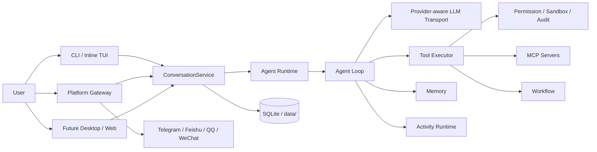

# Lumora

Lumora 是一个插件化、多入口、可观测的个人 AI Agent runtime。它把对话、工具、安全、平台接入、记忆、MCP、workflow、受控多 Agent 委派和 inline TUI 放进同一套后端运行时，而不是把它们拆成互不相干的脚本。

项目目标很明确：做一个能长期使用、能接平台、能观察运行状态、能安全执行工具、能持续扩展的个人 Agent 底座。

## 项目定位

| 方向 | 说明 |
| --- | --- |
| 统一后端 runtime | CLI、inline TUI、Gateway 和未来 desktop/web shell 共用同一套 agent loop、工具、安全、会话和 provider 能力。 |
| 插件化扩展 | 工具、平台、LLM provider/transport、memory provider、workflow 和 MCP 都通过插件系统装配。 |
| 结构化前端协议 | 前端消费 `ConversationEvent`、slash metadata、tool runs、activity payload 和 context budget，不靠解析散乱文本。 |
| 安全工具执行 | 工具调用统一经过 execution guard、precheck、permission、sandbox 和 audit。 |
| 可观测运行时 | tool truth、turn report、activity runtime、provider cache diagnostics 和 doctor 贯穿主链路。 |

## 架构概览



核心关系是：入口层只负责接入和展示，`ConversationService` 负责把输入转成统一会话请求，真正的推理、工具、安全、记忆、多模态和运行时状态都在后端 runtime 内收敛。

## 核心亮点

### 不是聊天脚本，而是 Agent runtime

Agent loop、LLM transport、工具执行、权限、安全、记忆、workflow、MCP、Gateway 和会话存储是独立模块，通过清晰接口组合。后续新增入口或平台时，不需要重写 agent 核心。

### Provider-aware transport

`ProviderProfile` 描述 provider 能力和缓存策略。transport 会按 provider 构建请求、归一化 usage，并记录 system/tools/message prefix hash，方便排查 Anthropic explicit cache、OpenAI-compatible prefix cache、Responses/Codex Responses 中转站等差异。

### 工具执行有真实审计链路

工具调用会产生实时 `tool_start`、`tool_decision`、`tool_end` 事件，同时持久化 `tool_runs` 和每轮 `AgentTurnReport`。系统能区分“模型真的调用了工具”和“模型只是嘴上说调用了工具”。

### 权限、安全和确认是主链路能力

危险操作不会直接裸露给模型。工具执行统一经过风险预览、权限决策、沙箱限制、路径检查、审计日志和可配置 execution mode。CLI/TUI 与 Gateway 都能走同一套确认语义。

### Activity Runtime 统一观察后台状态

`/activity` 可以查看子 agent、后台进程和 Gateway agent 的 summary/list/detail。前端拿到的是结构化 payload，可以直接渲染运行状态、耗时、token quota、工具计数和任务预览。

### Context 与 token 指标语义清晰

`context_used_tokens/context_window/context_percent` 表示当前上下文占用；`input_tokens/output_tokens` 表示最近一次模型调用消耗。前端不会再把一轮 API 消耗误当成上下文窗口占用。

### 多模态链路已经打底

Gateway 附件会进入结构化 `ConversationInput`。平台 adapter 负责把平台图片、文件、音频等标准化为 attachment，后端可按配置走 native、text fallback、notice 或 off。图片原生输入、文档文本抽取、vision fallback 和 OCR HTTP 扩展点都已预留。

### Steer 机制支持运行中修正

`/steer <text>` 可以向运行中的同会话 turn 注入高优先级修正。Gateway 侧支持旁路 busy check 入队，agent loop 会在下一步消费 steer 并重新组织后续行为。

## 当前能力

| 能力 | 状态 |
| --- | --- |
| 本地 CLI / inline TUI | 多轮对话、流式输出、thinking 展示、slash menu、工具确认、会话切换、导出、context meter。 |
| Slash commands | `/commands`、`/tools`、`/permissions`、`/protocol`、`/mode`、`/tool-runs`、`/activity`、`/usage` 等。 |
| 平台 Gateway | Telegram、飞书、QQ、微信插件式接入；支持会话路由、pending 消息、确认回复、重连和 gateway activity。 |
| 工具系统 | 文件、shell、网络、后台进程、工作区、记忆、delegate、workflow、MCP 工具统一注册和执行。 |
| 权限模型 | execution mode、category permission、限时授权、confirm timeout、Gateway 异步确认、audit log。 |
| 多 Agent | delegate/sub-agent 有配额、状态、结果、工具统计和 activity detail。 |
| 多模态 | 结构化 attachment、平台下载、本地缓存、图片原生输入、文档文本抽取、vision/OCR 扩展点。 |
| Provider / Transport | Chat Completions、Anthropic Messages、OpenAI Responses、Codex Responses、OpenRouter/DeepSeek 等兼容路径。 |
| 诊断与观测 | doctor、health snapshot、tool runs、turn reports、provider cache diagnostics、activity snapshot。 |

## 快速开始

当前对外项目名是 Lumora；为了避免破坏现有入口，Python 包名仍是 `personal_agent`，CLI 命令仍是 `personal-agent`。

安装依赖：

```bash
uv sync
```

初始化本地配置：

```bash
uv run personal-agent init --profile local --copy-env --fix-dirs
```

编辑 `.env`，至少填写：

```env
LLM_API_KEY=...
```

检查配置并启动：

```bash
uv run personal-agent doctor
uv run personal-agent chat
```

`personal-agent chat` 默认进入 inline TUI。也可以单轮调用：

```bash
uv run personal-agent chat "你好"
uv run personal-agent chat --once "总结一下当前项目"
```

启动平台 Gateway：

```bash
uv run personal-agent init --profile telegram --copy-env --fix-dirs
# 编辑 .env，填写 LLM_API_KEY 和 TELEGRAM_BOT_TOKEN
uv run personal-agent serve
```

## 常用命令

```bash
uv run personal-agent chat
uv run personal-agent serve
uv run personal-agent doctor
uv run personal-agent doctor --json
uv run personal-agent protocol schema --json

uv run personal-agent plugins list --load
uv run personal-agent plugins doctor platforms/telegram
uv run personal-agent memory doctor
uv run personal-agent agents list
uv run personal-agent tokens session
```

交互式 chat / inline TUI 中常用 slash commands：

```text
/commands
/tools list
/tool-runs summary
/activity
/usage
/mode
/permissions
/protocol schema
/steer <运行中修正>
```

## 配置

| 文件或目录 | 用途 |
| --- | --- |
| `.env` | 放 secret 和 provider/platform 环境变量，例如 `LLM_API_KEY`、`TELEGRAM_BOT_TOKEN`。 |
| `config.yaml` | 本机行为配置，例如 storage、plugins、memory、sandbox、MCP、auth、session、`agent.ui`、`execution.mode` 和 `execution.policy`。 |
| `config.yaml.example` | 可发布模板，不包含个人密钥和本机私有路径；新环境可从它复制出自己的 `config.yaml`。 |
| `plugins/` | 用户插件或本地开发插件目录。 |
| `data/` | 运行数据、会话、记忆、附件缓存、审计日志等。 |

详细说明见 [配置文档](docs/configuration.md)。

### 初始化 Profile

| Profile | 用途 |
| --- | --- |
| `local` | 本地 CLI 对话，最小配置。 |
| `server` | 长期运行服务，启用 external memory。 |
| `bot` | 通用 bot 配置，列出平台 env。 |
| `telegram` | Telegram bot，启用 `platforms/telegram`。 |
| `feishu` | 飞书 bot，启用 `platforms/feishu`。 |
| `wechat` | 微信 bot，启用 `platforms/wechat`。 |

常用初始化命令：

```bash
uv run personal-agent init --check
uv run personal-agent init --fix-dirs
uv run personal-agent init --copy-env
uv run personal-agent init --profile telegram --force
```

`--check` 只诊断，不写文件。旧配置迁移默认只给建议，不自动改写用户已有的 `config.yaml`。

## 平台接入

平台插件是 deferred 插件：启动时先发现，`serve` 时由 Gateway 加载、创建 adapter、连接平台。

| 平台 | 插件 key | 必要 env |
| --- | --- | --- |
| Telegram | `platforms/telegram` | `TELEGRAM_BOT_TOKEN` |
| 飞书 | `platforms/feishu` | `FEISHU_APP_ID`、`FEISHU_APP_SECRET` |
| QQ | `platforms/qq` | 按 OneBot/adapter 配置填写 |
| 微信 | `platforms/wechat` | `WEIXIN_TOKEN`、`WEIXIN_ACCOUNT_ID` |

Gateway 会记录平台 runtime 状态、自动重连、pending 消息、发送失败和运行中 agent。详细说明见 [平台文档](docs/platforms.md)。

## 插件、MCP 与 Skill

内置插件在 `src/personal_agent/plugins/builtin/`，用户插件放在根目录 `plugins/` 或 `data/plugins/`。插件负责注册能力，不接管具体运行时生命周期。

MCP server 通过配置接入，启动后工具会进入同一套 tool registry、permission pipeline 和 audit 体系。Skill 更适合沉淀可复用的提示、脚本和领域流程；MCP 更适合把外部服务暴露成标准工具。

插件开发说明见 [插件系统文档](docs/plugins.md)。

## 前后端协作契约

后端新增或改变任何前端可消费事件、命令、payload、diagnostic 字段或接口时，需要同步更新 [BACKEND_INTERFACE.md](BACKEND_INTERFACE.md)。

前端对后端的字段和接口需求记录在 [FRONTEND_INTERFACE_REQUIREMENTS.md](FRONTEND_INTERFACE_REQUIREMENTS.md)。

## 运维与排错

优先使用这些命令定位问题：

```bash
uv run personal-agent doctor
uv run personal-agent init --check
uv run personal-agent plugins list --load
uv run personal-agent protocol schema --json
```

更多命令和常见问题见 [运维文档](docs/operations.md)。

## 验证

改动合入前至少运行：

```bash
python -m compileall -q src/personal_agent
uv run pytest -q
```

当前主干最近一次全量验证结果：`804 passed`。

## 技术栈

Python 3.12+ / uv / Typer / asyncio / httpx / aiohttp / aiosqlite / tiktoken / fastembed / PyMuPDF / python-docx。

项目保持轻量 runtime，不依赖 LangChain、CrewAI 等重框架。

## 文档索引

| 文档 | 内容 |
| --- | --- |
| [docs/configuration.md](docs/configuration.md) | 配置项、profile、execution mode、sandbox、multimodal、MCP。 |
| [docs/platforms.md](docs/platforms.md) | Gateway 和平台插件接入。 |
| [docs/plugins.md](docs/plugins.md) | 插件系统和扩展方式。 |
| [docs/operations.md](docs/operations.md) | 运行、排错、doctor、常用维护命令。 |
| [BACKEND_INTERFACE.md](BACKEND_INTERFACE.md) | 后端提供给前端的结构化事件和接口契约。 |
| [CODEX_HANDOFF.md](CODEX_HANDOFF.md) | 前后端 Codex 协作和交接状态。 |
