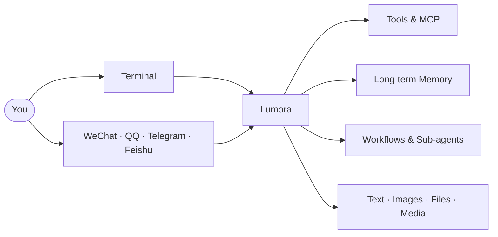

<div align="center">

<h1>Lumora</h1>

<p><strong>一个真正长期运行、会使用工具、拥有记忆、连接多平台的个人 AI 助手</strong></p>

<p>
  
  
  
  
  
  
  
</p>

<p>
  <a href="#快速开始">快速开始</a> ·
  <a href="docs/README.md">文档中心</a> ·
  <a href="docs/capabilities-and-boundaries.md">功能全景</a> ·
  <a href="docs/platforms.md">平台接入</a> ·
  <a href="docs/plugins.md">插件开发</a> ·
  <a href="docs/architecture.md">实现原理</a>
</p>

</div>

---

Lumora 不是套在模型外面的一层聊天界面。它可以在终端与你对话，也可以长期运行在微信、QQ、Telegram 和飞书；它会真实调用工具、记住重要信息、处理文件和图片，并在执行敏感操作前向你确认。

> 你面对的是同一个助手。换到另一个平台、隔几天再回来，工具、记忆、会话和行为边界仍然保持一致。

## 它能做什么

<table>
  <tr>
    <td width="33%" valign="top"><strong>使用电脑与工具</strong><br><br>读写文件、搜索内容、执行命令、运行代码、管理后台进程，并保留真实工具记录。</td>
    <td width="33%" valign="top"><strong>连接外部世界</strong><br><br>通过 MCP 使用 GitHub、浏览器、开发文档和其他外部服务，工具可按需发现。</td>
    <td width="33%" valign="top"><strong>记住长期信息</strong><br><br>保存偏好、经历、关系、承诺和行为信息，在后续会话中自然召回。</td>
  </tr>
  <tr>
    <td valign="top"><strong>跨平台陪伴</strong><br><br>支持 CLI、inline TUI、微信、QQ、Telegram 与飞书，不需要为每个平台配置一套人格。</td>
    <td valign="top"><strong>发送图片与文件</strong><br><br>理解用户附件，也能把截图、文档和工具产物作为真正的平台附件发回，而不是返回本地路径。</td>
    <td valign="top"><strong>完成复杂任务</strong><br><br>支持工作流、子 Agent、后台任务、运行中修正和停止，适合多步骤任务。</td>
  </tr>
</table>

## 使用方式

| 入口 | 适合场景 | 当前能力 |
| --- | --- | --- |
| **Inline TUI** | 本地开发、连续工作 | 流式回答、工具轨迹、命令菜单、权限确认、上下文状态 |
| **微信** | 日常对话与轻量任务 | 私聊、附件输入、图片/文件/视频发送 |
| **QQ / NapCat** | 长期在线与丰富媒体 | 私聊、群聊、图片、文件、音频、视频 |
| **Telegram** | Bot 与远程使用 | 文本、图片、文件、音频、视频 |
| **飞书** | 工作沟通 | 长连接消息、图片和文件 |
| **Cron / Plugin** | 定时与外部触发 | 使用正式会话、工具、记忆和投递链路 |



## 典型任务

<table>
  <tr>
    <td><strong>项目协作</strong></td>
    <td>“检查这个仓库最近的改动，找出风险并整理成报告发给我。”</td>
  </tr>
  <tr>
    <td><strong>网页操作</strong></td>
    <td>“打开这个页面，检查实际内容，截一张图并发给我。”</td>
  </tr>
  <tr>
    <td><strong>长期记忆</strong></td>
    <td>“记住我偏好的工作方式，下次给方案时继续按这个习惯。”</td>
  </tr>
  <tr>
    <td><strong>后台任务</strong></td>
    <td>“启动这个长任务，我需要时查看进度；现在先处理另一件事。”</td>
  </tr>
  <tr>
    <td><strong>多平台文件</strong></td>
    <td>“生成一份结果文件，然后直接通过当前聊天发给我。”</td>
  </tr>
</table>

## 安全不是一个开关

你可以按场景选择自动化程度：

| Mode | 行为 |
| --- | --- |
| **Read Only** | 只读取允许范围内的内容，扩权请求直接拒绝 |
| **Ask First** | 读取优先，写入和网络等资源按需确认 |
| **Local Auto** | 在工作目录内自主读写并使用网络，越界文件或显式高风险工具仍询问 |
| **Full Auto** | 最大化自动执行，但受保护路径等硬限制仍然有效 |

授权可以只允许一次，也可以在当前会话内限时生效。工具调用、拒绝原因和真实结果都有记录，不需要只相信模型声称做过什么。

[查看完整能力与安全边界](docs/capabilities-and-boundaries.md)

## 功能全景

| 能力 | 状态 | 说明 |
| --- | :---: | --- |
| 多轮会话与流式输出 | Ready | 会话切换、上下文统计、运行中停止与修正 |
| 文件、Shell、网络与进程工具 | Ready | 核心工具直接可用，低频能力按需发现，扫描和输出有界 |
| MCP Client Runtime | Ready | stdio / Streamable HTTP、后台启动、断线恢复 |
| 长期个人记忆 | Ready | Lumora、Mem0、混合检索和本地 Qdrant |
| 插件与 Skill | Ready | Tool、Skill、MCP、Hook、Command、Workflow 与热重载 |
| 多平台 Gateway | Ready | 微信、QQ、Telegram、飞书 |
| 入站与出站多模态 | Ready | 图片、文件、音频、视频按平台能力处理 |
| Workflow 与 Sub-agent | Ready | 并行、流水线、配额、活动状态 |
| 主动决策系统 | Planned | 已有正式触发入口，决策策略后续推进 |
| Desktop / Web | Reserved | 后端契约已预留，前端尚未实现 |

## 快速开始

需要 Python 3.12+ 和 [uv](https://docs.astral.sh/uv/)。

```bash
git clone https://github.com/sujinsheng123/Personal-Agent.git
cd Personal-Agent

uv sync
uv run personal-agent init --profile local --copy-env --fix-dirs
```

在 `.env` 中填写至少一个模型 API Key，然后检查环境：

```bash
uv run personal-agent doctor
uv run personal-agent chat
```

启动微信、QQ、Telegram 或飞书 Gateway：

```bash
uv run personal-agent serve
```

平台 Token、NapCat、MCP、Memory 和安全模式配置见 [配置说明](docs/configuration.md) 与 [平台接入](docs/platforms.md)。

## 扩展 Lumora

插件可以组合工具、Skill、MCP Server、Hook、命令和工作流，并通过 generation snapshot 在运行中安装、更新、回滚或卸载。当前仓库已经包含：

| 插件 | 提供能力 |
| --- | --- |
| **GitHub Assistant** | 仓库概览、PR Review、Issue 分类、Release Notes |
| **Developer Docs** | 查询库文档、比较 API、辅助版本升级 |
| **Browser Operator** | 网页检查、网页测试、受控页面操作 |
| **Codex Bridge** | 通过受限 MCP/Hook 连接外部 Codex 能力 |

[查看插件格式与注册能力](docs/plugins.md)

## 项目状态

<p>
  
  
  
  
</p>

```bash
python -m compileall -q src/personal_agent
uv run pytest -q  # 1093 passed, 1 warning
```

项目保持轻量 Python Runtime，不依赖 LangChain、CrewAI 等重型编排框架。

## 继续阅读

| 想了解 | 文档 |
| --- | --- |
| Lumora 到底有哪些能力 | [功能、边界与配置化](docs/capabilities-and-boundaries.md) |
| 输入如何变成工具调用和回复 | [架构说明](docs/architecture.md) |
| 哪些工具常驻、哪些能力按需发现 | [核心工具](docs/core-tools.md) |
| 如何配置模型、记忆、MCP 和安全模式 | [配置说明](docs/configuration.md) |
| 如何连接微信、QQ、Telegram、飞书 | [平台接入](docs/platforms.md) |
| 如何编写和组合插件 | [插件系统](docs/plugins.md) |
| 如何启动、诊断和排错 | [运维与排错](docs/operations.md) |
| 项目这段时间发生了什么 | [项目演进记录](PROJECT_EVOLUTION.md) |
| 后续准备推进什么 | [架构方向](lumora-roadmap.zh-CN.md) |

---

<div align="center">
  <strong>Lumora</strong><br>
  Tools, memory and conversations that stay with you.
</div>
