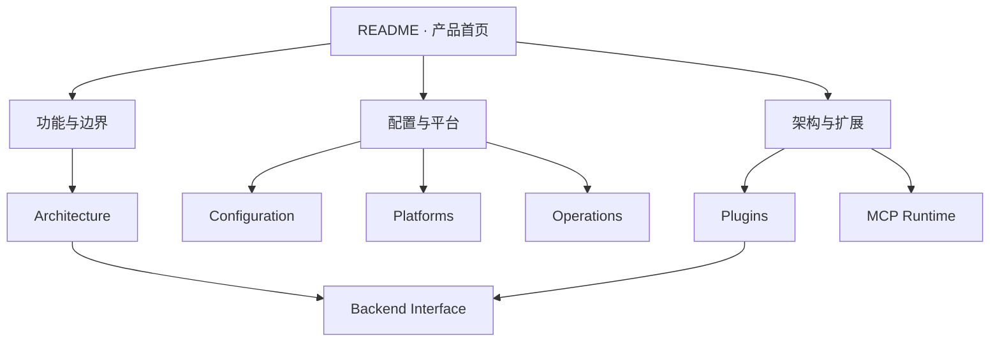

<h1>Lumora Docs</h1>

<strong>从“它能做什么”到“它为什么这样实现”</strong>

  
  
  

  <a href="../README.md">项目首页</a> ·
  <a href="capabilities-and-boundaries.md">功能全景</a> ·
  <a href="architecture.md">架构</a> ·
  <a href="configuration.md">配置</a> ·
  <a href="operations.md">运维</a>

---

## 选择你的阅读路线

<table>
  <tr>
    <td width="50%" valign="top"><strong>我想先了解 Lumora</strong>  <a href="capabilities-and-boundaries.md">功能、边界与配置化</a> 用功能和场景理解项目，不要求先读源码。</td>
    <td width="50%" valign="top"><strong>我准备运行它</strong>  <a href="configuration.md">配置说明</a> <a href="platforms.md">平台接入</a> <a href="operations.md">运维与排错</a></td>
  </tr>
  <tr>
    <td valign="top"><strong>我准备开发它</strong>  <a href="architecture.md">架构说明</a> <a href="plugins.md">插件系统</a> <a href="mcp-runtime-design.md">MCP Runtime</a></td>
    <td valign="top"><strong>我想了解项目历史</strong>  <a href="../PROJECT_EVOLUTION.md">项目演进记录</a> <a href="../lumora-roadmap.zh-CN.md">后续架构方向</a> <a href="../TODO.md">当前待办</a></td>
  </tr>
</table>

## 文档地图

## 权威文档

| 主题 | 唯一权威入口 |
| --- | --- |
| 前端可消费事件、命令和字段 | [BACKEND_INTERFACE.md](../BACKEND_INTERFACE.md) |
| 前端向后端提出的新需求 | [FRONTEND_INTERFACE_REQUIREMENTS.md](../FRONTEND_INTERFACE_REQUIREMENTS.md) |
| 后端当前进度 | [BACKEND_PROGRESS.md](../BACKEND_PROGRESS.md) |
| 前端当前进度 | [FRONTEND_PROGRESS.md](../FRONTEND_PROGRESS.md) |
| 阶段性项目变化与代码规模 | [PROJECT_EVOLUTION.md](../PROJECT_EVOLUTION.md) |

> 历史计划已经清理。遇到重复描述时，以本页列出的权威入口和更新时间较新的文档为准。
