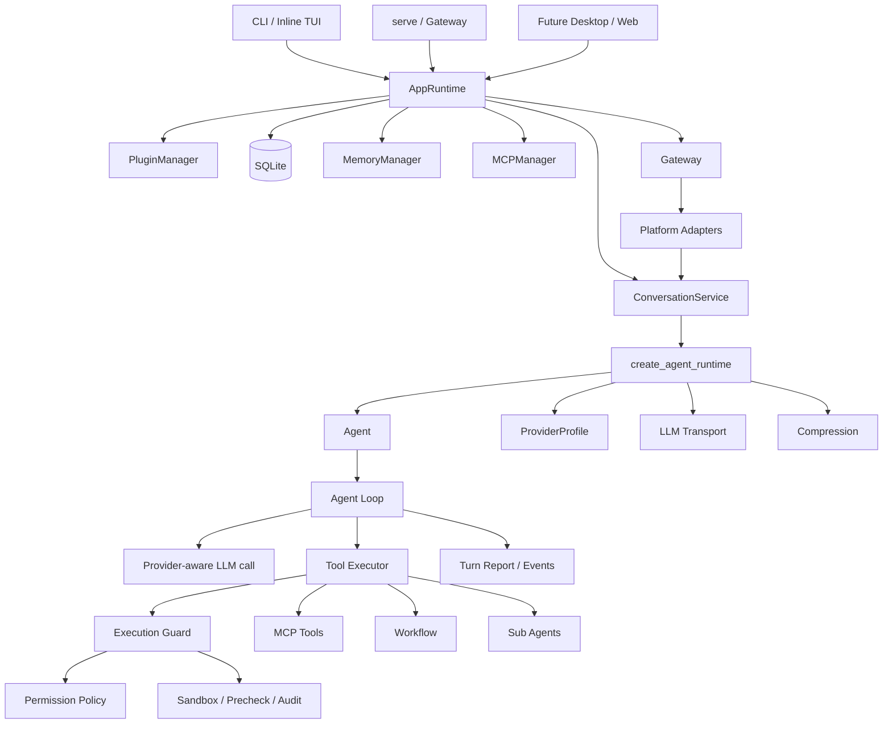
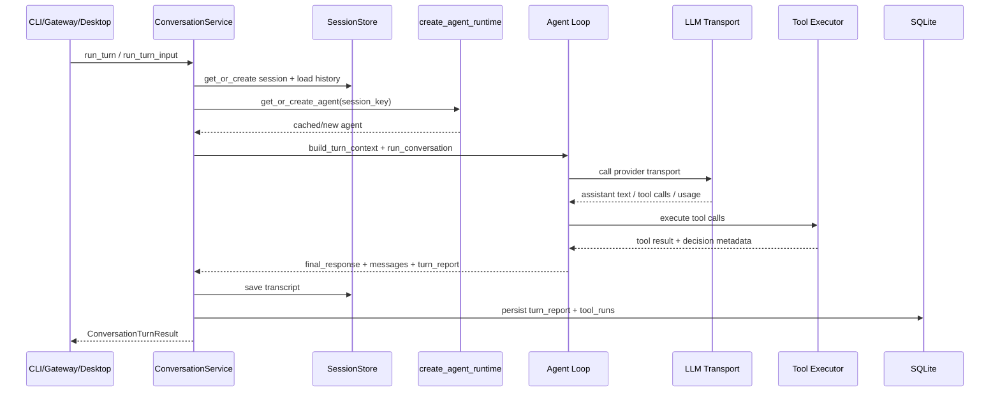

# 架构说明

这份文档描述 Lumora 当前后端架构。它面向后续维护者、前端/桌面端接入者和想扩展 provider、工具、平台、MCP、skill 的开发者。

README 只放项目展示；功能亮点和安全边界见 [能力、边界与配置化](capabilities-and-boundaries.md)；配置细节见 [配置说明](configuration.md)。

## 总体结构

Lumora 的核心是一个共享 Agent Runtime。CLI、inline TUI、Gateway 和未来 desktop/web 入口都进入同一套 `ConversationService`，再由它创建或复用 agent。



核心原则：

- 入口层只处理输入输出和平台差异。
- `ConversationService` 是统一会话边界。
- Agent Runtime 负责 provider、transport、工具、记忆、压缩和插件 hook 的装配。
- 工具执行必须经过统一 executor、permission、sandbox 和 audit。
- Gateway 不直接处理模型协议；provider 不参与平台附件下载。

## 目录职责

| 路径 | 职责 |
| --- | --- |
| `src/personal_agent/runtime.py` | 应用级 bootstrap，创建 `AppRuntime`，装配配置、插件、数据库、记忆、MCP、session store、conversation service 和 gateway。 |
| `src/personal_agent/conversation/` | 会话服务、输入结构、事件记录、slash command runtime、运行中 steer。 |
| `src/personal_agent/agent/` | agent 初始化、上下文构建、主循环、retry、turn report、finalize。 |
| `src/personal_agent/llm/` | provider profile、transport registry、HTTP client、token 估算。 |
| `src/personal_agent/plugins/builtin/llm/builtin/` | Chat Completions、Anthropic Messages、Responses/Codex Responses transport。 |
| `src/personal_agent/tools/` | 工具注册、执行器、权限门控、sandbox、audit、URL safety、redaction。 |
| `src/personal_agent/plugins/builtin/tools/` | 内置工具实现。 |
| `src/personal_agent/gateway/` | 平台 Gateway、运行状态、session router、异步确认、auth、压缩链路。 |
| `src/personal_agent/platforms/` | 平台抽象、attachment helper 和平台注册表。 |
| `src/personal_agent/plugins/builtin/platforms/` | Telegram、Feishu、QQ、WeChat adapter。 |
| `src/personal_agent/attachments/` | 附件本地缓存、hash 去重、文本提取。 |
| `src/personal_agent/multimodal/` | 附件处理、图片文本化、vision/OCR 扩展点。 |
| `src/personal_agent/memory/` | 记忆抽象、管理器和 review service。 |
| `src/personal_agent/mcp/` | MCP server 管理和 MCP tool 接入。 |
| `src/personal_agent/workflow/` | workflow registry 和执行引擎。 |
| `src/personal_agent/tui/` | inline TUI 前端展示层。 |
| `src/personal_agent/db/` | SQLite 持久化。 |

## 启动链路

### AppRuntime

`create_app_runtime()` 位于 `runtime.py`。它是应用级装配入口，负责：

- 读取 `Settings`
- 创建数据目录和系统目录
- 发现、加载、配置插件
- 初始化 sandbox 和 audit
- 启动 MCP manager
- 打开 SQLite
- 创建 `CompressionChain`
- 创建 `SessionStore`
- 创建 `MemoryManager`
- 创建 `MemoryReviewService`
- 创建 `ConversationService`
- 生成 boot report 和 health snapshot

`AppRuntime` 持有这些共享对象，并提供：

- `create_gateway()`
- `start_gateway()`
- `stop_gateway()`
- `close()`
- `health_snapshot()`

### AgentRuntime

`create_agent_runtime()` 位于 `agent/factory.py`。它是每个会话 agent 的装配入口，负责：

- 根据 `settings.llm_provider` 获取 `ProviderProfile`
- 根据 `LLM_API_MODE` 或 provider/base URL 自动探测 API mode
- 从 `transport_registry` 获取 transport
- 创建 compressor
- 调用 `init_agent()`
- 注入 plugin hooks
- 设置 workflow engine 的 LLM call 和工具列表

`ConversationService` 会按 `session_key` 缓存 agent，避免每轮都重新创建。

## 入口层

### CLI / Inline TUI

CLI 命令入口在 `cli.py`、`cli_chat.py` 和 `cli_shell.py`。它们的核心职责是：

- 解析命令行参数
- 创建 `AppRuntime`
- 选择 session
- 调用 `ConversationService.run_turn()` 或事件流接口
- 渲染流式事件、thinking、工具确认、slash command 和最终回复

CLI/TUI 不应该直接拼 LLM 请求，也不应该绕过工具执行器。

### Gateway

`personal-agent serve` 会启动 `AppRuntime.start_gateway()`，随后进入 `Gateway.start()`。

Gateway 负责：

- 加载平台插件
- 创建和连接平台 adapter
- 维护平台 runtime 状态
- 连接失败后按 backoff 重连
- 管理平台 session key
- 处理 auth
- 处理 slash command
- 处理 pending tool confirmation
- 处理 busy session 和 `/stop` / `/steer` 旁路
- 触发平台附件准备
- 调用 `ConversationService`
- 发送最终回复

Gateway 不负责 provider 选择、LLM 协议、工具执行细节或附件内容解析。

## 一轮对话的流转

### 文本输入



### 结构化输入

`ConversationInput` 是当前统一输入结构。它可以包含：

- `text`
- `source`
- `attachments`
- metadata

旧接口 `run_turn(session_key, source, text)` 会被转换为 `ConversationInput`，保持兼容。桌面端和 Gateway 后续应优先使用结构化输入。

## Gateway 消息流

平台 adapter 收到消息后，会传给 `Gateway._handle_message()`。

处理顺序：

1. 建立 trace id。
2. 计算当前 `session_key`。
3. 触发 message hooks。
4. 做平台 auth。
5. 处理 slash command。
6. pending tool confirmation 回复旁路处理。
7. busy session 检查。
8. 标记当前 session running。
9. 调用 `_prepare_inbound_attachments()`。
10. 将平台事件转成 envelope / `ConversationInput`。
11. 调用 `ConversationService.run_turn_input()`。
12. 触发 before-send hooks。
13. 触发 memory review。
14. 返回最终文本给 adapter。

`/stop` 和 `/steer` 可以在同会话运行中旁路 adapter 队列。工具确认回复也会旁路普通 busy check。

## Provider 与 Transport

Provider 和 transport 是两层：

- `ProviderProfile` 描述 provider 能力和策略。
- transport 负责具体 wire protocol。

当前支持的主要协议：

| API mode | transport | 用途 |
| --- | --- | --- |
| `chat_completions` | Chat Completions transport | OpenAI-compatible、DeepSeek、很多中转站。 |
| `anthropic_messages` | Anthropic transport | Anthropic Messages 协议或兼容路径。 |
| `responses` | OpenAI Responses transport | OpenAI Responses API。 |
| `codex_responses` | Codex Responses transport | Codex/Ahoo 这类 responses wire API 中转站。 |

`LLM_API_MODE=auto` 时，会按 provider/base URL 探测。中转站不稳定时，建议显式配置 API mode。

transport 还负责：

- stream delta
- usage 归一化
- cache usage 解析
- context usage 估算输入
- 多模态 content block 转换
- provider-specific error handling

## 工具、权限与安全

模型发出的 tool call 不会直接执行。工具链路是：

```text
tool call
  -> ToolRegistry
  -> ToolExecutor
  -> ExecutionGuard
  -> PermissionPolicy
  -> Sandbox / precheck
  -> tool implementation
  -> audit / tool_runs / turn_report
```

关键边界：

- execution mode 决定默认权限。
- `execution.policy.tool_permissions` 可以覆盖类别权限。
- `/allow` 只对 `ask` 生效，不能覆盖 `deny`。
- sandbox roots 和 blocked patterns 是硬边界。
- bash 网络由 `sandbox.bash_allow_network` 单独控制。
- secret/path precheck 和 destructive precheck 不应被关闭。

工具结果会进入事件、turn report、tool runs 和 audit，前端可以展示真实工具调用，而不是只看模型文字。

## 多模态与附件

多模态链路分三段：

```text
platform adapter
  -> AttachmentRef
  -> adapter.prepare_inbound_attachments()
  -> AttachmentStore
  -> ConversationInput
  -> MultiAttachmentProcessor
  -> ResolvedConversationInput
  -> Agent Loop
  -> Provider Transport
```

职责划分：

- 平台 adapter 负责识别平台消息中的图片、文件、音频、视频和平台 file id。
- Gateway 在授权通过后触发 adapter 准备附件。
- `AttachmentStore` 负责本地缓存、hash 去重和读取。
- `MultiAttachmentProcessor` 按配置决定 native、text、notice 或 off。
- provider/transport 只处理最终传给模型的格式，不决定是否下载平台文件。

这条边界很重要：下载是平台适配能力，内容处理是 multimodal 能力，模型协议转换是 transport 能力。

## Slash Command 与运行中控制

slash command 由 `commands/registry.py` 和 `commands/runtime.py` 统一管理。

CLI/TUI 和 Gateway 使用不同的 command runtime，但共享命令核心。这样 `/mode`、`/permissions`、`/activity`、`/tool-runs`、`/usage`、`/stop`、`/steer` 等命令可以在不同入口保持一致。

`SteerManager` 属于 `ConversationService`，按 `session_key` 和 `turn_id` 管理运行中注入。Gateway 中 `/steer` 可以绕过 busy check，agent loop 在下一步消费 steer。

## Activity 与可观测性

运行态观测主要来自：

- `AppRuntime.health_snapshot()`
- `Gateway.health_snapshot()`
- `ConversationService.turn_report_summary()`
- `ConversationQueryService`
- `activity_snapshot()`
- tool runs
- turn reports
- provider cache diagnostics

这些数据用于 doctor、slash command、前端状态面板和排错。

## 插件与扩展点

插件系统负责装配外部能力，而不是让核心 runtime 直接依赖所有实现。

常见扩展点：

- LLM transport
- platform adapter
- tool
- MCP server
- memory provider
- workflow
- skill
- hooks

插件 hook 可以参与：

- agent 创建后
- LLM 调用前后
- 工具执行前后
- 消息收到后
- 回复发送前

扩展时应优先进入已有 registry 和 hook，不要直接在入口层硬编码新逻辑。

## 数据与持久化

默认运行数据在 `data/` 下：

| 数据 | 位置或来源 |
| --- | --- |
| SQLite 会话和查询数据 | `data/state.db` |
| 附件缓存 | `data/attachments/` |
| 派生附件结果 | `data/attachments/derived/` |
| audit log | `data/audit.log` |
| compression chain | `data/compression_chain.json` |
| cron jobs | `data/cron/` |
| 插件运行数据 | `data/plugins/` |

`.env` 存 secret，不应提交。`config.yaml` 是本机行为配置，发布时应使用 `config.yaml.example`。

## 前端和桌面端接入原则

未来 desktop/web 不需要复制 agent loop。推荐接入方式：

- 构造 `ConversationInput`。
- 使用 `ConversationService.run_turn_input_events()` 或后续 HTTP/WebSocket wrapper。
- 消费统一事件协议。
- 工具确认、activity、usage、tool runs、turn reports 复用后端结构。
- 附件上传后转换成 `AttachmentRef`，由后端多模态链路处理。

前端只负责展示和交互，不直接处理 provider 协议、工具权限或平台下载逻辑。

## 维护原则

- 新入口接 `ConversationService`，不要新建第二套 agent loop。
- 新 provider 优先补 `ProviderProfile` 和 transport，不要在 agent loop 写 provider 分支。
- 新工具必须走 tool registry、executor、permission 和 audit。
- 新平台 adapter 只处理平台差异，附件内容处理交给 multimodal。
- 新状态字段要同步 `BACKEND_INTERFACE.md`。
- 新配置优先进入 config registry、example、configuration docs 和 doctor。
