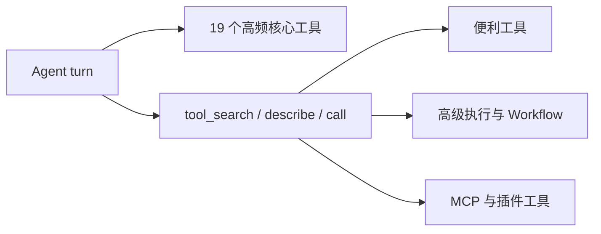

# Core Agent Tools

**让高频工具直接可用，让低频能力按需出现**

[项目首页](../README.md) · [文档中心](README.md) · [架构说明](architecture.md) · [安全边界](capabilities-and-boundaries.md)

---

## 暴露原则

Registry 继续保存全部能力，但模型每轮只接收稳定的核心 schema。低频工具通过工具桥接搜索并进入同一 Executor、Permission、Sandbox 和 Audit 管道，不会因为延迟暴露而绕过安全检查。

## 核心集合

| 领域 | 直接暴露工具 | 原因 |
| --- | --- | --- |
| 文件 | `read`、`write`、`edit`、`list_directory`、`file_info`、`grep`、`glob` | 浏览、检查、搜索和修改文件的基础动作 |
| Shell | `bash` | 短时、受限命令入口 |
| Web | `web_search` | 外部信息搜索入口；读取具体网页使用 Fetch MCP |
| Memory | `memory`、`memory_buffer` | 长期信息和内部缓冲 |
| Skill | `skill_search`、`skill_load` | 按任务加载专业指导 |
| Agent | `sub_agent` | 单一、通用的委派原语 |
| Process | `process_start`、`process_read`、`process_wait`、`process_kill` | 长任务最常用生命周期 |

当存在延迟工具时，Registry 额外暴露 `tool_search`、`tool_describe` 和 `tool_call` 三个桥接入口。三者读取当前 Turn 的 Capability lease，而不是实时全局 Registry；插件热更新后，旧 Turn 不会提前看到或调用新 generation 工具。

## 按需能力

以下工具没有删除，只是不再常驻每轮 Prompt：

| 类别 | 工具示例 | 处理理由 |
| --- | --- | --- |
| 简单便利功能 | calculator、datetime、random、timer、json、weather | 低频且容易挤占模型选择空间 |
| 计划与持久任务 | todo、task | 只在用户明确需要任务管理时加载 |
| 高级执行 | execute_code、process_list、process_clear | Bash/常用进程原语已覆盖日常路径 |
| 多 Agent 组合 | sub_parallel、sub_pipeline、delegate_task、run_review | 保留能力，避免多个近义入口常驻 |
| Workflow / Worktree | workflow_*、worktree_* | 专项且部分操作风险较高 |
| 交互与附件 | clarify、confirm、artifact_from_file、response_attach | 由明确任务或系统提示触发搜索 |
| 文档转换 | `document_convert` | 仅在需要读取 PDF、Office、HTML 等本地文档时发现 |
| MCP / 插件 | 动态 MCP 工具；`plugin_inspect`、`plugin_build`、`plugin_manage` | 数量不稳定或操作低频，统一按需发现 |

## 可靠性边界

| 工具 | 当前保证 |
| --- | --- |
| `list_directory` | 单层浏览、稳定排序、`offset/limit` 分页、5 秒和 10k 条目预算 |
| `file_info` | 文件类型、大小、时间、MIME、文本/二进制判断和读写范围诊断 |
| `glob` | 线程扫描、目录剪枝、`max_depth`、隐藏项开关、100 默认结果上限、10 秒和 50k 条目预算 |
| `grep` | 共用有界扫描、逐行读取、跳过二进制和大文件、50 匹配上限 |
| `read` | `offset/limit` 分页、50k 字节窗口、二进制拒绝、线程 I/O |
| `write/edit` | UTF-8 实际字节限制、同目录原子替换、超大文件编辑拒绝 |
| `bash` | `cached` 工具审批、声明式 `cwd/read_paths/write_paths`、Linux Bubblewrap 或 Windows AppContainer PowerShell 7、超时与中断、64 KiB 捕获上限 |
| `mcp__fetch__fetch` | 由 Fetch MCP 动态提供；服务不可用时明确返回 MCP unavailable，不回退到本地抓取工具 |
| `document_convert` | 只读精确路径、50 MiB 输入上限、30k 字符分页、格式规模上限与可选 LibreOffice 旧格式转换 |
| 后台进程 | 异步读取，stdout/stderr 各自只保留 4k 字符尾部 |
| 插件工具 | 查询绑定 live manager；列表返回有界摘要；构建路径经过 sandbox；审批按 action 分级且卸载保留数据 |

实际事故中的 `/home/sujinsheng` 全目录 `glob('*')` 从约 379 秒降至约 0.02 秒，并在找到 100 个结果后立即停止。

目录浏览不需要再借助 Bash：`list_directory(path)` 默认只返回当前层；需要按文件名递归查找时再使用 `glob`。`glob(max_depth=1)` 只匹配搜索根目录下的文件，`max_depth=2` 才进入一层子目录。

扫描器会静默跳过与查询无关的受保护项。宽泛的 `*.jpg`、`*.jdg` 或 `*.toml` 搜索不会因为路过 `pyproject.toml` 而终止回合；明确请求受保护文件名时仍返回不可扩权的硬拒绝。

`bash` 与 `process_start` 不再把整个宿主文件系统只读挂入子进程。默认只提供命令运行所需的系统目录、`cwd` 和本次声明的 `read_paths` / `write_paths`；目录外文件必须先作为精确资源进入统一审批。命令字符串扫描只负责提前拦截明显错误，真正边界由 Bubblewrap mount plan 保证，因此 Python 拼接路径、引号差异或脚本内部打开文件都不能看到未声明的宿主路径。

在 Linux/WSL 上，内置 shell 使用 Bubblewrap 文件系统隔离；在原生 Windows 上，宿主通过一次性 Shell Broker 把 PowerShell 7 放入独立 AppContainer，并用 Job Object 管理整棵子进程树。两端都保留相同的命令白名单、精确路径审批、网络开关和审计语义，Doctor 均报告 `security_level=os-isolated`。只有显式设置 `process_backend: legacy` 时，Windows 才回到旧的 `controlled-host` 模式。

## 已知边界

- `web_search` 当前依赖 Bing 页面解析并使用 DDGS fallback，不需要付费 API，但结果质量和站点结构有关。
- 延迟工具依赖 `tool_search` 的检索质量；工具描述、标签和中文别名需要持续维护。
- 工具线程超时后不能强制杀死 Python 线程，因此扫描内核自身也必须检查时间和条目预算。
- 单次模型响应中的重复 `tool_use_id` 会在写入对话前被合并；相同 ID 只执行第一项，冲突参数不会执行。不同 ID 的相同调用保持原有语义。
- 受保护路径、精确资源授权和审计规则在核心与按需工具之间完全一致。
