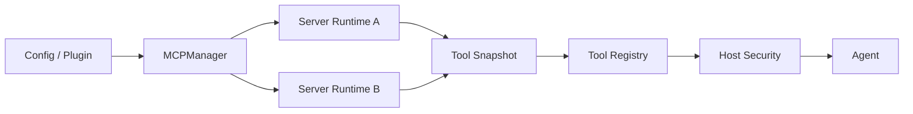

<div align="center">

<h1>MCP Runtime</h1>

<p><strong>长期连接、动态工具与故障隔离的外部能力运行时</strong></p>

<p>
  
  
  
</p>

<p>
  <a href="../README.md">项目首页</a> ·
  <a href="README.md">文档中心</a> ·
  <a href="plugins.md">插件</a> ·
  <a href="configuration.md#mcp-server">配置</a>
</p>

</div>

---

> **状态**：核心 Runtime 于 2026-07-12 完成；后台启动、安全收口和 Artifact 支持补充至 2026-07-18。



## 目标

Lumora 将 MCP 从一次性 stdio 工具加载器演进为长期运行的外部能力 runtime，同时保留现有工具权限、安全、审计和渐进式披露语义。

## 决策

- 使用官方 MCP Python SDK 的稳定 v1.x 协议与 transport 实现，依赖约束为 `mcp>=1.27,<2`。
- Lumora 自己管理 server 生命周期、重连、工具快照、Registry 同步、健康状态和安全策略。
- SDK 类型只存在于 MCP connection adapter 内部；Manager、runtime 和工具层使用 Lumora 自己的模型。
- 每台 server 使用独立 `MCPServerRuntime`，单台故障不得影响其他 server。
- stdio 与 Streamable HTTP 实现同一个 connection contract。
- 旧配置没有 `transport` 且包含 `command` 时继续按 stdio 解释。
- 工具名继续使用 `mcp__{server}__{tool}`，并继续经过 `ToolExecutor`、permission 和 audit。
- 短暂断线时保留工具归属并标记 unavailable；server 被禁用、删除或确认移除工具时才注销。
- 工具列表变化通过完整快照 diff 同步，刷新失败保留最后一次成功快照。
- MCP 结果保留结构化 content，并提供当前工具协议可消费的文本 fallback。
- 应用启动只创建各 server 的后台 runtime，不等待全部远程握手；工具快照 ready 后通过 Registry generation 让现有 Agent 下一轮刷新。
- stdio server 可声明独立 `work_dir`、`artifact_roots` 和扩展名白名单；相对文件结果只有在受控根目录内才可提升为 Artifact。
- MCP 工具仍声明具体 network/filesystem 资源，经过 Security v4、typed Hook、executor 和 audit。

## Connection Contract

```python
class MCPConnection(Protocol):
    async def connect(self) -> MCPServerInfo: ...
    async def list_tools(self) -> list[MCPToolSpec]: ...
    async def call_tool(self, name: str, arguments: dict) -> MCPCallResult: ...
    async def close(self) -> None: ...
```

SDK session、transport context manager 和 notification callback 均由 connection adapter 封装，其他模块不得直接依赖 SDK 类型。

## 兼容契约

- 保留 `MCPManager.start()`、`stop()`、`health_snapshot()`、`total_tools` 和 `client_names`。
- 保留现有 stdio `name`、`command`、`args`、`env`、`enabled` 配置。
- 保留 doctor 中 server 连接、工具数量、错误和 stderr 摘要字段。
- Registry generation 变化后，现有 Agent 继续自动刷新工具视图。

## 失败语义

- 工具调用不无限等待重连；连接不可用时返回稳定的 temporarily-unavailable 结果并唤醒后台恢复。
- 网络中断和 stdio 子进程退出进入自动重连。
- 配置错误和确定的认证错误停止自动快速重试，并在 health 中给出原因。
- runtime `stop()` 必须取消连接、通知、刷新和重连任务，且重复调用安全。

## 暂不包含

- MCP server 模式或多 Agent 控制平面。
- 通用插件热重载。
- 默认开放 sampling 或 elicitation。
- 完整 OAuth 用户交互。
- 每台 server 单独创建线程。
- 平台出站媒体发送（由 Artifact/Delivery 子系统负责，不属于 MCP runtime）。

## 验证标准

- 旧 stdio 配置与工具命名保持兼容。
- 单台 server 故障和恢复不影响其他 server。
- `tools/list_changed` 能增删和更新工具，失败时不丢失旧快照。
- Streamable HTTP 可以连接、调用、断线恢复和安全关闭。
- MCP 工具仍经过权限与审计链路。
- 应用关闭后没有遗留子进程、网络 session、后台任务或 Registry 工具。

## 当前实现结果

- stdio、Streamable HTTP、keepalive、退避重连、`tools/list_changed`、快照 diff 和单 server 隔离已完成。
- GitHub、Context7、Fetch、Sequential Thinking、Playwright 等 server 已经过真实或 focused 验证。
- OAuth、sampling、elicitation、legacy SSE 和 MCP server mode 仍按明确需求后置。
- MCP 不作为多 Agent 控制平面；插件主动提交通过 capability-bound Conversation port 完成。
