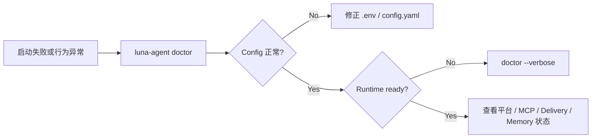

<div align="center">

<h1>运维与排错</h1>

<p><strong>从“能不能启动”到“是哪条链路出了问题”</strong></p>

<p>
  
  
  
</p>

<p>
  <a href="../README.md">项目首页</a> ·
  <a href="README.md">文档中心</a> ·
  <a href="configuration.md">配置</a> ·
  <a href="platforms.md">平台</a>
</p>

</div>

---

## 30 秒排错路线



这份文档只覆盖日常使用和排错入口。

## 新环境启动

本地 CLI：

```bash
uv sync
uv run luna-agent init --profile local --copy-env --fix-dirs
# 编辑 .env，填写 LLM_API_KEY
uv run luna-agent doctor
uv run luna-agent chat
```

Telegram bot：

```bash
uv run luna-agent init --profile telegram --copy-env --fix-dirs
# 编辑 .env，填写 LLM_API_KEY 和 TELEGRAM_BOT_TOKEN
uv run luna-agent doctor
uv run luna-agent serve
```

## 常用命令

```bash
uv run luna-agent chat
uv run luna-agent chat "单轮消息"
uv run luna-agent serve

uv run luna-agent doctor
uv run luna-agent doctor --verbose
uv run luna-agent doctor --json
uv run luna-agent init --check

uv run luna-agent plugins list --load
uv run luna-agent plugins doctor <plugin-key>
uv run luna-agent plugins validate examples/plugins/hello

uv run luna-agent memory doctor
uv run luna-agent memory list
uv run luna-agent agents list
uv run luna-agent tokens session
```

## 配置迁移

旧配置迁移先诊断，不自动覆盖：

```bash
uv run luna-agent init --check
uv run luna-agent doctor
```

重点看输出里的：

- `已废弃配置`
- `迁移建议`
- `警告`
- `推荐命令`

常见迁移：

- 顶层 `llm` 改到 `.env` 的 `LLM_*`。
- 顶层 `platform` / `platforms` 删除，平台 token 改到 `.env`。
- 平台插件用 `plugins.enabled` 显式启用，例如 `platforms/telegram`。

## 插件热重载

包安装状态可以用 `luna-agent plugins install|rollback|uninstall` 离线管理；Gateway/TUI 已运行时使用核心 `/plugins` 命令，操作会直接进入当前 `PluginManager`，不需要重启进程。独立 CLI 进程中的 `reload` 只用于加载验证，真正的进程内热重载应使用 `/plugins reload`。

更新会发布新 Capability Snapshot。新 Turn 立即使用新 generation，执行中的 Turn 保持旧 lease；`plugin_runtime.active_leases` 与 `retired_revisions` 可以判断旧实例是否仍在排空。普通卸载保留 `data/plugins/data/<plugin-key>`，只有显式 `--purge-data` 才删除数据。

主动 runner 只由 Gateway 管理，默认关闭。`/plugins active <key> on|off|restart` 可在运行中控制；`/plugins info <key>` 和 `plugin_runtime.active_plugins[]` 会显示 `state`、`ready`、`restart_count`、`circuit_open` 与最近错误。热更新时 v2 未 ready 不会替换 v1，候选数据 revision 也不会成为 current。

## Doctor 结果怎么读

`doctor` 默认输出启动体检摘要，适合普通用户判断能不能运行；`doctor --verbose` 输出完整开发诊断，包含 runtime、effective config、插件、MCP、Gateway、工具和 sandbox 明细；`doctor --json` 给脚本或前端消费完整结构化数据。

MCP verbose 诊断会展示每台 server 的 `state`、`transport`、工具数、重连次数、下一次重试和最近错误。常见状态：

- `ready`：连接和工具快照可用。
- `degraded`：连接仍可用，但最近一次工具列表刷新失败，继续保留旧快照。
- `reconnecting`：连接已断开，runtime 正在后台退避重试。
- `failed`：配置或凭据环境变量错误，不会持续快速重试。
- `stopped` / `disabled`：runtime 已停止或配置禁用。

Streamable HTTP 的 `headers_env` 配置填写环境变量名。缺少变量时 health 只展示变量名，不记录或回显凭据值。

`Config`：

- `config.yaml: 否`：运行 `luna-agent init`。
- `.env: 否`：运行 `luna-agent init --copy-env` 或 `cp .env.example .env`。
- `LLM key: 否`：填写 `.env` 的 `LLM_API_KEY`。
- `unknown keys`：确认是否是旧配置或拼写错误。

`Gateway`：

- `running agents` 大于 0：有正在处理的会话。
- `pending messages` 持续增长：Coordinator 中的会话提交积压。
- `stop requested` 大于 0：有 run 收到了停止请求。

`平台配置`：

- `runtime=skipped`：平台 env 不完整或插件未启用。
- `runtime=reconnecting`：连接失败，Gateway 正在自动重试。
- `attempts` 持续增加：平台一直连接不上。
- `pending` 持续增加：平台收消息正常，但 Coordinator/Agent 处理速度不足；发送重试积压另查 Delivery Outbox。

`插件`：

- `ERROR`：manifest、env 或 entrypoint 有问题。
- `DEFERRED`：延迟加载，平台/MCP 触发时才 import，通常不是错误。

`Bash / process_start`：

- `bash-strict requires bwrap`：当前系统不能建立严格进程文件系统；安装 Bubblewrap，或明确接受风险后把 `sandbox.process_backend` 设为 `legacy`。
- `read access is not granted` / `Approval required for read ...`：把具体文件或目录放入 `read_paths`，不要依赖命令文本中的绝对路径。
- `strict sandbox mount scan exceeded its safety budget`：`cwd` 过宽；切换到更小的工作目录并只声明任务需要的路径。
- `doctor.sandbox.process.bash_effective_backend` 为 Bash 实际后端；`effective_backend` 保留通用/MCP 兼容后端含义。

`Delivery`：

- `session has no delivery binding`：旧版本常见于 Gateway 重启后、用户尚未再次发消息时的主动提交；当前版本会从 SessionStore 恢复绑定并把暂时缺失视为 `DEFERRED`。
- `DEFERRED`：Conversation 已完成，消息已进入 Outbox 等待平台或目标恢复，不应重新提交同一 Agent turn。
- Outbox 持续 `retry`：检查平台 adapter 是否 connected，以及 session 记录中的 `platform/chat_id` 是否仍有效。
- 主动插件同一事件反复出现：确认插件使用稳定 `request_id`；Inbox Watch 同一文件签名达到 `max_submission_attempts` 后会停止提交，文件变化后才重新尝试。

## 验证命令

多模态出站排错时同时检查：

- `data/artifacts/` 是否可写，文件是否仍存在。
- `delivery_outbox` 与 `delivery_outbox_parts` 是否处于 `pending/retry/ambiguous`。
- `tool_end.artifacts` 是否返回了 `artifact_id` 和 `delivery_eligible=true`。
- Agent 是否实际调用 `response_attach`；只有生成文件而未选择，不会发送附件。
- `write`、`edit` 或 `bash` 生成的普通本地文件是否先经过 `artifact_from_file`；该工具成功后才会产生可选择的 `artifact_id`。
- 平台 capability 是否支持对应类型；不支持时应收到文字降级，而不是本地路径。
- 微信媒体需要 `WEIXIN_CDN_BASE_URL` 可访问，并经过 `getuploadurl`、加密 CDN 上传和 `sendmessage` 三步。
- 微信与 QQ 的剩余实机用例见根目录 `PLATFORM_MEDIA_TEST_CHECKLIST.md`。

提交前建议运行：

```bash
python -m compileall -q src/luna_agent
uv run pytest -q
```
