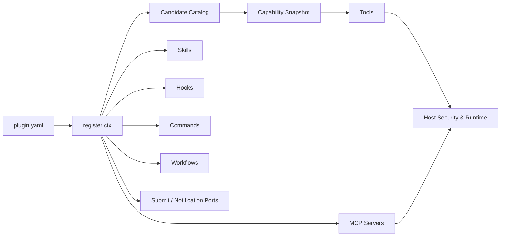

<div align="center">

<h1>插件系统</h1>

<p><strong>用一个 <code>register(ctx)</code> 组合 Tool、Skill、MCP、Hook、Command 与 Workflow</strong></p>

<p>
  
  
  
  
  
</p>

<p>
  <a href="../README.md">项目首页</a> ·
  <a href="README.md">文档中心</a> ·
  <a href="architecture.md">架构</a> ·
  <a href="configuration.md">配置</a>
</p>

</div>

---



Luna Agent 的被动插件系统不要求插件继承基类。插件通过同步 `register(ctx)` 声明当前 generation 的能力；宿主构建不可变 `CapabilitySnapshot` 并原子发布。现有 Tool、Skill、Hook、MCP 等 manager 继续负责执行，快照只负责稳定路由和生命周期一致性。

<table>
  <tr>
    <td width="50%"><strong>插件负责</strong><br><br>声明能力、注册资源、读取自己的配置、响应稳定 Hook。</td>
    <td width="50%"><strong>宿主负责</strong><br><br>连接、权限、安全、审计、生命周期、故障隔离和最终执行。</td>
  </tr>
</table>

已启用插件在启动时发布首份能力快照；运行中可以安装、重载、禁用、回滚或卸载。平台插件仍可使用 `deferred: true`，由 Gateway 首次解析平台时激活。

插件注册的 MCP server 配置会在应用启动时统一交给 `MCPManager`。连接、重连、动态工具快照和关闭都由 MCP runtime 管理；插件不应自行启动 MCP 子进程或网络 session。

## 最终目录结构

插件引擎代码固定放在 `src/luna_agent/plugins/core/`：

```text
src/luna_agent/plugins/
  core/
    context.py
    manager.py
    models.py
  runtime/
    catalog.py
    mapper.py
    snapshot.py
    identity.py
  install/
    installer.py
    store.py
  builtin/
    platforms/
      feishu/
        __init__.py
        adapter.py
        plugin.yaml
      telegram/
        __init__.py
        adapter.py
        plugin.yaml
      wechat/
        __init__.py
        adapter.py
        plugin.yaml
      qq/
        __init__.py
        adapter.py
        companion.py
        config.py
        plugin.yaml
    memory/
      plugin.yaml              # 只注册 memory 工具
      __init__.py
      luna/
        __init__.py
        provider.py
        backends/
        plugin.yaml
      mem0/
        __init__.py
        provider.py
        plugin.yaml
    tools/
      builtin/
        __init__.py
        plugin.yaml
        *.py
      bridge/
        __init__.py
        bridge.py
        plugin.yaml
    skills/
      builtin/
        __init__.py
        plugin.yaml
    workflows/
      review/
        __init__.py
        workflow.py
        plugin.yaml
    llm/
      builtin/
        __init__.py
        plugin.yaml
        *.py
```

仓库根目录的 `plugins/` 只给用户插件或本地开发插件使用。内置插件不要放到根目录 `plugins/`。

当前根目录通用插件包括 `github_assistant`、`developer_docs`、`browser_operator` 和 `codex_bridge`。前三者分别组合 Skill、MCP、Hook 和状态命令；它们用于验证插件装配边界，不会把 MCP 生命周期或安全策略搬进插件私有实现。

仓库里也保留了一个最小示例插件：

```text
examples/plugins/hello/
  __init__.py
  plugin.yaml
  skills/
    hello/
      SKILL.md
```

它演示了用户插件最常见的包式结构：插件目录本身是 Python package，`plugin.yaml` 的 `entrypoint` 写成 `hello:register`。

## SDK 与 AI 开发入口

外置插件的稳定数据契约位于独立 workspace 包 `packages/luna-agent-plugin-sdk`。插件应从 `luna_agent_plugin_sdk` 导入 `PluginRuntimeContext`、`ToolEntry`、`CommandEntry`、`HookEvent`、Hook outcome 和主动资源声明；`luna_agent.*` 保留给宿主实现与暂未稳定的运行服务。旧宿主导入路径暂时重导出同一类型，不代表新插件应继续依赖它们。

面向 AI 编写插件时，先获取机器可读边界，再生成与验证：

```bash
uv run luna-agent plugins capabilities --json
uv run luna-agent plugins schema manifest
uv run luna-agent plugins schema scaffold
uv run luna-agent plugins create ./my-plugin --spec ./plugin-spec.yaml
uv run luna-agent plugins test ./my-plugin --contract --integration
uv run luna-agent plugins package ./my-plugin
```

`create --spec` 支持 `tool`、`skill`、`mcp`、`hook`、`command`、`active` 特性，并生成 `plugin.yaml`、入口模块、`AGENTS.md`、README 和契约测试。`--contract` 使用 SDK 的 `FakePluginRuntimeContext`，不启动宿主；`--integration` 使用临时数据目录中的真实 `PluginManager`，会执行注册、依赖解析和候选能力构建，但不污染正式插件状态。`plugins diff <v1> <v2>` 会比较版本、依赖/能力声明和内容哈希；`plugins package` 生成排除缓存文件的确定性 ZIP。

## plugin.yaml

每个插件包必须有 `plugin.yaml`、`plugin.yml` 或 `plugin.json`。内置插件由 `PluginManager` 递归扫描 `src/luna_agent/plugins/builtin/**/plugin.yaml` 发现；用户插件从配置里的插件目录发现。

必填字段：

```yaml
schema_version: 1
key: memory/luna
name: Luna Agent Memory Provider
version: "1.0.0"
plugin_api: ">=1,<2"
entrypoint: luna_agent.plugins.builtin.memory.luna:register
requires:
  sdk: ">=0.1,<1"
```

常用可选字段：

```yaml
description: Hybrid semantic and BM25 external memory provider.
kind: memory
provides: [memory_provider:luna]
tags: [memory, retrieval]
requires_env: []
enabled_by_default: true
deferred: false
record_import_delta: false
```

`key` 是启用/禁用插件时使用的稳定身份，不要用展示名代替。推荐类似 `platforms/telegram`、`memory/luna`、`workflows/review` 这样的 key。

manifest 会做严格校验：

- `key` 必须是小写分段格式，例如 `builtin/tools`、`platforms/telegram`、`examples/hello`。
- `entrypoint` 必须是 `module` 或 `module:function`，模块名和函数名都要是合法 Python 标识符。
- `schema_version` 目前固定为 `1`。
- `plugin_api` 声明插件兼容的宿主注册协议；外置插件应显式填写。
- `kind` 表示主要分类，支持平台、记忆、集成、开发、自动化等现有枚举。
- `source` 由扫描边界确定为 `builtin`、`local` 或 `installed`，不信任插件自己的声明。
- `requires_env`、`provides`、`tags` 必须是字符串或字符串列表。
- `enabled_by_default`、`deferred`、`record_import_delta` 必须是布尔值。
- `deferred: true` 只允许用于 `kind: platform`。

依赖统一放在 `requires`：

```yaml
requires:
  luna_agent: ">=0.1,<1"
  sdk: ">=0.1,<1"
  plugins:
    - key: integrations/github-assistant
      version: ">=0.2,<1"
  capabilities: [conversation.submit, storage.read_write]
  mcp_tools:
    github: [list_issues]
```

宿主与 SDK、Plugin API、插件版本和 capability 缺失是加载阻塞错误；MCP 工具可能在后台连接后才出现，因此启动检查先给 warning，真正调用仍由 MCP Runtime 判定。插件按依赖拓扑加载，循环依赖会阻止环内插件激活。卸载有启用中的 dependent 时默认拒绝；`--force` 会先禁用 dependent，但不删除它们的 package 或数据。

manifest 有错时插件不会消失，会以 `invalid/<目录名>` 留在插件列表里，方便 `plugins doctor` 或 `plugins validate` 给出具体错误。

## 入口函数

`entrypoint` 可以指向模块，也可以指向模块里的函数。常见写法：

```python
def register(ctx) -> None:
    ctx.register.skills("skills")
    ctx.register.mcp("mcp.yaml")
    ctx.register.hook("configure", configure, priority=10)
```

`register()` 必须是同步函数。会阻塞、会联网、会启动进程的事情不要放进 `register()`，应该放到 hook 里，或者交给对应子系统的 manager 处理。

用户插件可以用两种组织方式：

```text
plugins/demo/
  plugin.yaml              # entrypoint: demo_plugin:register
  demo_plugin.py
```

或：

```text
plugins/hello/
  plugin.yaml              # entrypoint: hello:register
  __init__.py
```

## PluginRuntimeContext 能注册什么

每个 generation 会拿到独立的 `PluginRuntimeContext`，绑定 `plugin_key`、`generation_id` 和 `runtime_instance_id`。注册能力集中在 `ctx.register`：

- `config`：只读的 `plugins.config.<plugin-key>`
- `conversation`：按 manifest capability 约束的 `ConversationCoordinator` submit 端口
- `notifications`：单独授权的直接 Delivery 通知端口
- `storage`：限定在 `data/plugins/data/<plugin-key>/` 的数据端口
- `tasks`：绑定 runtime instance 的受控后台任务端口；DRAINING 后不能创建新任务
- `parse_config(PydanticModel)`
- `get_env(name)`：统一通过 Settings 边界解析
- `ctx.register.skills(relative_path="skills")`
- `ctx.register.mcp(relative_path="mcp.yaml")`
- `ctx.register.tool(ToolEntry)` / `skill(SkillEntry)` / `workflow(WorkflowDef)`
- `ctx.register.platform(PlatformEntry)`
- `ctx.register.mcp_server(MCPServerConfig | dict)`
- `ctx.register.memory_provider(name, factory, validator)`
- `ctx.register.hook(event, callback, priority=100, name="", matcher="*", timeout=None)`
- `ctx.register.command(CommandEntry)`
- `ctx.register.active(run=..., resources=ActiveResourceRequest(...))`

`conversation` 和 `notifications` 不是通用核心对象引用：没有对应 capability 的插件无法使用，submit 仍经过 session、Coordinator、ConversationService 和 Delivery 语义。普通插件也不要注册任意 agent role/team；多 Agent 仍然是 core runtime。

`ctx.register.skills()` 支持平铺 `.md` 和 `skills/<name>/SKILL.md`；`ctx.register.mcp()` 支持 YAML/JSON 中的 `servers` 列表。注册只在 PREPARING 阶段开放，ACTIVE 阶段的 MCP 工具变化通过受控 capability refresh 发布新快照。

## 主动插件

主动插件仍是普通 generation，只额外注册一个长期根运行器；它不是 Job/Cron，也不拥有第二套 Capability Snapshot。插件内部可以用 `asyncio.TaskGroup` 组织自己的短期或长期任务，宿主只管理根任务和 generation 生命周期。

```python
from luna_agent_plugin_sdk import ActiveResourceRequest

async def run(ctx):
    storage = ctx.resources.storage
    await ctx.runtime.ready()
    while not ctx.runtime.stop_requested:
        await ctx.runtime.wait_until_resumed()
        # discover -> acquire declared resources -> deliver
        await ctx.runtime.wait_until_stopped()

def register(ctx):
    ctx.register.active(
        run=run,
        resources=ActiveResourceRequest(
            tools=("read",),
            mcp={"github": ("list_issues",)},
            required_mcp_servers=("github",),
            llm=True,
            conversation=True,
            delivery=True,
            artifacts=True,
        ),
        restart_policy="on_failure",
    )
```

运行语义：

1. `register()` 只收集能力和 runner，不会启动任务。
2. 只有 `luna-agent serve` 创建的 Gateway 是 active owner；CLI chat、doctor 和 validate 不启动 runner。
3. 插件初始化完成后调用 `await ctx.runtime.ready()`。该调用会阻塞到宿主提交 generation；提交后才允许正式发现、调用资源和投递。
4. Gateway 停止、插件关闭或 generation 退休时，宿主先请求停止根任务，再按逆序关闭 generation scope 中的连接和清理回调。

插件加载与主动执行是两个开关。`plugins.enabled` 决定 Tool/Skill/Hook 等被动能力是否加载；`plugins.config.<key>.active.enabled` 默认 `false`，决定 Gateway 是否启动根 runner。运行中可以使用：

```text
/plugins active examples/active-heartbeat on
/plugins active examples/active-heartbeat off
/plugins active examples/active-heartbeat restart
```

`ctx.resources` 是 generation-bound facade：

| 端口 | 约束 |
| --- | --- |
| `tool.call(name, input)` | 必须精确声明；写入、Shell、后台进程、代码执行和 destructive 工具硬拒绝 |
| `mcp.call(server, tool, input)` | server 与 remote tool 都必须精确声明；仍经过 Tool Executor、Hook 与审计 |
| `llm.complete(...)` | 必须声明 `llm=True`，默认复用宿主当前 LLM 配置 |
| `conversation.submit(...)` | 必须声明并受 active session allowlist 约束，进入 Coordinator |
| `delivery.send(...)` | 必须声明并受 session allowlist 约束，进入 DeliveryService |
| `artifacts.create/get` | 必须声明；只能读取该插件自己创建的 Artifact |
| `storage` | 始终限定在当前插件的数据 revision |

主动调用没有交互式确认通道。资源声明就是宿主给该 generation 的精确非交互授权；未声明调用直接拒绝，所有调用仍通过现有硬安全、Hook、执行与审计管道。当前是受信任的进程内插件模型；若未来开放第三方市场，再在 generation 外增加系统级进程沙箱。

根任务异常退出时按 `never`、`on_failure` 或 `always` 重启；默认退避为 `1/2/5/10/30` 秒，可通过 `active.restart_backoff_seconds` 修改。同一 generation 在 5 分钟内连续失败 5 次会打开熔断，需 `/plugins active <key> restart` 人工恢复。

### Workspace Watch 示例

仓库内的 `examples/plugins/workspace_watch` 是一个可安装的主动插件，不是单纯心跳：

1. 周期性通过受限 `file_info` 工具读取指定文件的大小和修改时间。
2. 第一次扫描只建立基线；变化持续超过 `settle_seconds` 才算稳定。
3. 多个稳定变化合并成一次 `ConversationCoordinator` 请求，由主 Agent 判断是否值得提醒。
4. 已通知签名保存在该插件的数据 revision 中，重启和热更新不会重复报告同一状态。

```yaml
plugins:
  enabled: [integrations/workspace-watch]
  config:
    integrations/workspace-watch:
      paths: ["TODO.md", "BACKEND_PROGRESS.md"]
      session_key: "wechat:<chat_id>:<user_id>"
      poll_interval_seconds: 30
      settle_seconds: 10
      active:
        enabled: true
        sessions: ["wechat:<chat_id>:<user_id>"]
        restart_backoff_seconds: [1, 2, 5, 10, 30]
```

`session_key` 必须同时出现在 `active.sessions` 精确 allowlist 中。启动 Gateway 后可用 `/workspace-watch-status` 查看配置与 runner 状态；也可以用 `/plugins active integrations/workspace-watch off|on|restart` 临时控制。没有配置 session 时插件仍可观察并更新基线，但不会向任何会话投递。

### 正式主动插件

仓库根目录目前提供四个可实际运行的主动插件：

| 插件 | 触发来源 | 使用的宿主资源 |
| --- | --- | --- |
| `integrations/github-assistant` | PR、Issue、Commit、GitHub Actions 变化 | GitHub 只读 MCP、Storage、Conversation |
| `automation/reminder` | 持久化截止时间 | Storage、Conversation |
| `automation/feed-watch` | RSS/Atom 新条目 | `feed_fetch`、Storage、Conversation |
| `automation/inbox-watch` | `data/inbox/` 稳定文件 | `list_directory`、`file_info`、`artifact_from_file`、Conversation |

`automation/inbox-watch` 对同一文件版本默认最多提交 3 次；达到
`max_submission_attempts` 后保持失败记录，只有文件签名变化才会重新尝试。

这些插件第一次观察外部状态时只建立基线；没有变化时不会调用 LLM。Reminder 和 Inbox 使用稳定 request id，Feed 与 GitHub 使用事件集合摘要生成 request id。显式稳定 ID 的插件提交默认写入 SQLite Submission Ledger：同一 owner/origin/id 的相同载荷在进程重启后复用结果，冲突载荷拒绝；Conversation 已完成但 Delivery 尚未完成时只恢复确定性 `delivery_id` 的 Outbox 投递，不重跑模型。未提供稳定 ID 的普通提交仍只使用有界内存去重。主动功能默认关闭，并要求目标 session 同时出现在 `active.sessions`。

Feed Watch 默认拒绝解析到私网或回环地址的订阅源。若 Watt Toolkit 等本地加速器有意将公网域名映射到本地，可通过 `trusted_private_hosts` 精确声明主机名。该配置不会放行其他域名，云元数据地址仍始终禁止：

```yaml
plugins:
  config:
    automation/feed-watch:
      trusted_private_hosts: ["github.com"]
```

Inbox 不删除或移动原文件。每个目标 session 会得到独立 scope 的 Artifact；Conversation Port 会再次校验 Artifact owner 和 session，插件不能把其他 runtime 的产物注入会话。

## 插件管理查询

`PluginManager` 仍是唯一的生命周期所有者。读取能力挂在 `plugin_manager.queries`：

```python
plugin_manager.queries.list_plugins()
plugin_manager.queries.plugin_info(key)
plugin_manager.queries.versions(key)
plugin_manager.queries.events(key)
plugin_manager.queries.operations(key=key)
```

`PluginQueryService` 只映射状态，不执行 install/reload/uninstall；操作锁由 `PluginOperationTracker` 持有，真实生命周期位置向 `PluginEventJournal` 写入事件。不存在包装 `PluginManager` 的第二个控制 Manager。

## 插件配置

```yaml
plugins:
  enabled: [examples/hello]
  config:
    examples/hello:
      greeting: "hi"
```

插件只会在 `ctx.config` 中看到自己的子树。密钥不写入该子树，由 `requires_env`/MCP `headers_env` 声明后经 Settings 解析。

## 注册事务与冲突

`register(ctx)` 在 generation 准备事务中执行。任何异常或跨插件同名冲突都不会发布候选快照。Tool、Skill、Workflow、Platform、Command、Memory Provider 和 MCP Server 不允许跨插件重名；同一 Hook 事件可以有多个有序回调。

## Hook 规则

正式运行时 Hook 由独立的 `HookManager` 管理，`PluginManager` 只负责注册转发、插件归属和卸载清理。回调接收只读的 `HookEnvelope`，并返回事件对应的 outcome：

```python
from luna_agent_plugin_sdk import HookEvent, PreToolUseOutcome

async def protect_write(event):
    path = str(event.payload.get("input", {}).get("path") or "")
    if path.endswith(".pem"):
        return PreToolUseOutcome.block("private key files are protected")
    return PreToolUseOutcome()

def register(ctx) -> None:
    ctx.register.hook(
        HookEvent.PRE_TOOL_USE,
        protect_write,
        name="protect_private_keys",
        matcher="file_write",
        priority=20,
        timeout=2.0,
    )
```

`HookEnvelope` 的公共字段包括 `event_name`、`scope`、`session_key`、`turn_id`、`agent_id`、`cwd`、`mode`、`triggered_at`、`source`、`payload` 和 `schema_version`。Payload 只放当前事件所需的 JSON-safe 数据；插件不应修改 envelope 或把密钥写入 outcome。

正式事件与返回类型：

| 事件 | matcher 对象 | 返回类型 | 语义 |
|---|---|---|---|
| `GatewayStart` / `GatewayStop` | 无 | `None` | Gateway 生命周期观察 |
| `PlatformConnected` / `PlatformDisconnected` | platform | `None` | 平台连接状态观察 |
| `GatewayMessageReceived` | platform | `GatewayMessageOutcome` | 鉴权后按顺序变换或阻止入站消息 |
| `PreDelivery` | platform | `PreDeliveryOutcome` | Delivery 发送前按顺序变换或抑制普通消息 |
| `PostDelivery` | platform | `None` | Outbox 单次投递结果观察 |
| `SessionStart` | `new` / `resume` / `clear` | `ContextHookOutcome` | 会话首次使用时添加上下文或停止本轮 |
| `UserPromptSubmit` | platform | `ContextHookOutcome` | 用户提示进入 Agent 前添加上下文或停止本轮 |
| `PreCompact` / `PostCompact` | `auto` | `ContextHookOutcome` / `None` | 压缩前延期/补上下文，压缩后观察 |
| `Stop` | 无 | `StopOutcome` | 最终答案后最多要求继续一次 |
| `PreToolUse` | tool name | `PreToolUseOutcome` | 安全评估前阻止、补上下文或改写参数 |
| `PermissionRequest` | tool name | `PermissionRequestOutcome` | 对需要确认的调用 allow / deny / abstain |
| `PostToolUse` | tool name | `PostToolUseOutcome` | 保留真实审计结果，只改变模型可见反馈或补上下文 |

执行规则：

- `priority` 越小优先级越高；matcher 使用正则 `fullmatch`，`"*"` 表示全部匹配。
- Gateway 入站消息和 PreDelivery 按优先级串行变换，后一个 Hook 能看到前一个 Hook 的结果。
- Context、policy 和 observer 事件中的多个回调并发执行，再按事件规则保守聚合。
- 多个 `PreToolUse` 参数改写冲突时只采用最高优先级的改写；任意 deny/block 都优先于 allow。
- `PreToolUse` 异常或超时 fail-closed；`PermissionRequest` 异常视为 abstain；Gateway、context 和 observer 默认 fail-open。
- Hook 附加上下文只进入当前 turn 的模型请求，不写入 transcript；`PostToolUse` 也不会覆盖真实 tool result 和审计记录。
- 禁用时新快照立即移除 Hook；旧 Turn 仍使用自己的 lease，最后一个 lease 释放后才移除旧 generation 的 Hook。

`configure`、`on_agent_created`、`on_session_selected`、`wechat_qr_login` 目前仍是宿主内部使用的专用生命周期回调，不属于正式运行时事件。旧的 `on_before_llm_call`、`on_after_llm_call`、`on_before_tool_exec`、`on_after_tool_exec`、`on_message_received`、`on_before_send` 已移除；插件注册这些名称会直接报错。主 Agent 不开放 LLM request/response 改写 Hook。

Memory provider 使用专用 registry 注册，不通过通用 hook 创建，避免多个插件互相覆盖。

## Command 规则

插件 command 使用 `CommandEntry`，`scope` 支持 `slash`、`cli`、`both`。

命令路由规则：

- 用户输入 `/xxx` 时先匹配核心命令，再匹配插件命令。
- Gateway 只会执行 `scope="slash"` 或 `scope="both"` 的插件命令。
- CLI chat 会优先执行 `scope="cli"`，也兼容 `scope="slash"` 和 `scope="both"`，避免旧插件默认 scope 失效。
- `/help` 会展示当前入口可见的插件命令。

插件不能覆盖核心 slash command：

- `/stop`
- `/deny`
- `/new`
- `/session`
- `/usage`

禁用插件时会移除它注册的 command。

## 加载策略

内置插件可以默认启用。用户插件原则上默认 opt-in。

`deferred: true` 的平台插件会被发现，但 `load_enabled()` 默认不会 import 它们；Gateway 启动时再加载已启用平台。普通插件可以在启动期加载，也可以通过运行中的核心 `/plugins` 命令激活。

缺少 `requires_env` 的插件会进入 `ERROR`，但 manifest、错误和诊断信息仍然保留。

## 热重载、安装与卸载

插件包不会直接从开发目录运行。安装器先复制或安全解压到 staging，校验 manifest、入口、符号链接、路径穿越、文件数量与大小，再按内容摘要移动到不可变目录：

```text
data/plugins/
  packages/<plugin-key>/<package-digest>/
  staging/
  data/<plugin-key>/current.json
  data/<plugin-key>/revisions/<runtime-instance>/
  install-state.json
```

每个运行实例都有三个身份：`generation_id` 表示包、有效配置与 Plugin API 的组合；`runtime_instance_id` 表示本次存活实例；`snapshot_revision` 表示宿主当前能力视图。更新会先准备隔离 module namespace、MCP 与候选数据 revision，再 quiesce v1 并启动 v2。只有 v2 调用 `ready()` 后，宿主才提交数据指针和 Capability Snapshot、放行 v2、停止 v1。失败会丢弃候选 revision 并 resume v1。执行中的 Turn 持有旧 lease，不会中途切换；旧实例在 lease 清空后进入 STOPPED。

普通卸载先发布不包含该插件的新快照，再等待旧 lease 排空并删除 package；插件数据默认保留，只有 `--purge-data` 才删除隔离数据目录。更新保留历史 package，可按 digest 回滚。

第一版安装源支持本地目录、ZIP 与 TAR；不会执行 `install.sh`/post-install 脚本，也不会修改宿主 `.venv`。Git 和 Marketplace 后续只需增加 source resolver，不改变 Runtime。

## 记忆提供器

记忆领域与编排位于核心 `src/luna_agent/memory/`：internal Markdown、Agent revision snapshot、observation buffer、SQLite archive、异步 review worker、router 和 fallback。

可替换的外部提供器位于插件包：

- `memory/luna`：Memory LLM、可替换 embedding/vector/keyword/fusion/可选 reranker backend；当前使用百炼 embedding、local/remote Qdrant、SQLite FTS5/BM25 和 RRF。
- `memory/mem0`：官方 `mem0ai` 依赖的薄适配层。
- `builtin/memory`：只注册 `memory` / `memory_buffer` 工具。

核心 fallback 不属于插件，主 provider 缺依赖、配置错误或运行失败时自动接管 SQLite + BM25 存储。

Luna Agent provider 的 SQLite Archive 是权威数据源，向量和关键词索引可以重建。Backend factory 位于 provider 内部，不提升为全局插件系统，也不让每个检索组件拥有独立生命周期。配置见 `docs/configuration.md` 的 Memory Backend 章节。

## 常用诊断命令

```bash
uv run python -m luna_agent plugins list --load
uv run python -m luna_agent plugins info memory/luna --load
uv run python -m luna_agent plugins logs integrations/github-assistant
uv run python -m luna_agent plugins versions integrations/github-assistant
uv run python -m luna_agent plugins operations
uv run python -m luna_agent plugins doctor memory/mem0 --json
uv run python -m luna_agent plugins validate examples/plugins/hello
uv run luna-agent plugins capabilities --json
uv run luna-agent plugins test examples/plugins/hello --contract --integration
uv run luna-agent plugins diff examples/plugins/hot_reload_probe_v1 examples/plugins/hot_reload_probe_v2
uv run luna-agent plugins package examples/plugins/hello
uv run python -m luna_agent plugins install ./plugins/my_plugin
uv run python -m luna_agent plugins install ./plugins/my_plugin --no-enable
uv run python -m luna_agent plugins reload integrations/github-assistant
uv run python -m luna_agent plugins rollback user/my-plugin <package-digest>
uv run python -m luna_agent plugins uninstall user/my-plugin
uv run python -m luna_agent doctor --json
```

Gateway/TUI 运行中使用同一控制面：

```text
/plugins list
/plugins info integrations/github-assistant
/plugins logs integrations/github-assistant
/plugins versions integrations/github-assistant
/plugins operations integrations/github-assistant
/plugins install /absolute/path/to/plugin
/plugins reload integrations/github-assistant
/plugins disable integrations/github-assistant
/plugins active examples/active-heartbeat on
/plugins uninstall user/my-plugin
```

`plugins validate <path>` 可以直接校验一个插件目录或 manifest 文件，不要求先把插件目录写进 `config.yaml`：

```bash
uv run python -m luna_agent plugins validate examples/plugins/hello
uv run python -m luna_agent plugins validate examples/plugins/hello --json
uv run python -m luna_agent plugins validate examples/plugins/hello --no-load
```

默认会执行 `register()`，所以能发现入口导入失败、缺环境变量、注册时报错、command/hook 注册冲突等问题。`--no-load` 只检查 manifest、环境变量和入口导入，不执行注册函数。

示例插件端到端检查：

```bash
uv run python -m luna_agent plugins validate examples/plugins/hello
```

输出里应该能看到：

- `校验结果: 通过`
- `commands: hello`
- `skills: hello-example`
- `hooks: example_hello:100`

插件相关改动合入前至少跑：

```bash
python -m compileall -q src/luna_agent
uv run pytest -q
```
