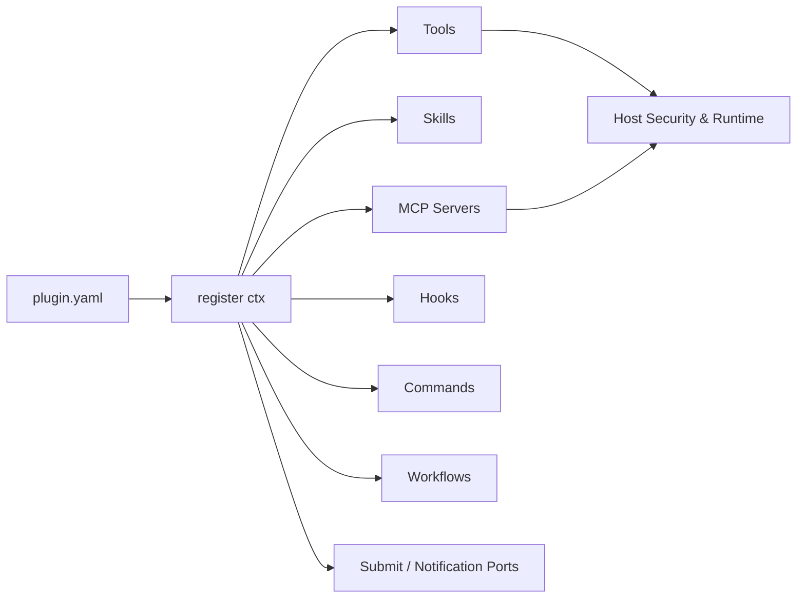

<div align="center">

<h1>插件系统</h1>

<p><strong>用一个 <code>register(ctx)</code> 组合 Tool、Skill、MCP、Hook、Command 与 Workflow</strong></p>

<p>
  
  
  
</p>

<p>
  <a href="../README.md">项目首页</a> ·
  <a href="README.md">文档中心</a> ·
  <a href="architecture.md">架构</a> ·
  <a href="configuration.md">配置</a>
</p>

</div>

---



Lumora 的被动插件系统是一个“装配层”：插件不需要继承基类，只通过同步 `register(ctx)` 把能力放入已有 registry。对应 manager 负责连接、运行、停止和后续热加载，插件层不接管子系统生命周期。

<table>
  <tr>
    <td width="50%"><strong>插件负责</strong><br><br>声明能力、注册资源、读取自己的配置、响应稳定 Hook。</td>
    <td width="50%"><strong>宿主负责</strong><br><br>连接、权限、安全、审计、生命周期、故障隔离和最终执行。</td>
  </tr>
</table>

已启用的普通插件在 Skill、MCP 等 manager 初始化前完成注册。平台插件是唯一允许 `deferred: true` 的类型，由 Gateway 启动时加载。

插件注册的 MCP server 配置会在应用启动时统一交给 `MCPManager`。连接、重连、动态工具快照和关闭都由 MCP runtime 管理；插件不应自行启动 MCP 子进程或网络 session。

## 最终目录结构

插件引擎代码固定放在 `src/personal_agent/plugins/core/`：

```text
src/personal_agent/plugins/
  core/
    context.py
    manager.py
    models.py
  builtin/
    platforms/
      feishu/
        __init__.py
        adapter.py
        plugin.yaml
      telegram/
        __init__.py
        adapter.py
        plugin.yaml
      wechat/
        __init__.py
        adapter.py
        plugin.yaml
      qq/
        __init__.py
        adapter.py
        companion.py
        config.py
        plugin.yaml
    memory/
      plugin.yaml              # 只注册 memory 工具
      __init__.py
      lumora/
        __init__.py
        provider.py
        backends/
        plugin.yaml
      mem0/
        __init__.py
        provider.py
        plugin.yaml
    tools/
      builtin/
        __init__.py
        plugin.yaml
        *.py
      bridge/
        __init__.py
        bridge.py
        plugin.yaml
    skills/
      builtin/
        __init__.py
        plugin.yaml
    workflows/
      review/
        __init__.py
        workflow.py
        plugin.yaml
    llm/
      builtin/
        __init__.py
        plugin.yaml
        *.py
```

仓库根目录的 `plugins/` 只给用户插件或本地开发插件使用。内置插件不要放到根目录 `plugins/`。

当前根目录通用插件包括 `github_assistant`、`developer_docs`、`browser_operator` 和 `codex_bridge`。前三者分别组合 Skill、MCP、Hook 和状态命令；它们用于验证插件装配边界，不会把 MCP 生命周期或安全策略搬进插件私有实现。

仓库里也保留了一个最小示例插件：

```text
examples/plugins/hello/
  __init__.py
  plugin.yaml
  skills/
    hello/
      SKILL.md
```

它演示了用户插件最常见的包式结构：插件目录本身是 Python package，`plugin.yaml` 的 `entrypoint` 写成 `hello:register`。

## plugin.yaml

每个插件包必须有 `plugin.yaml`、`plugin.yml` 或 `plugin.json`。内置插件由 `PluginManager` 递归扫描 `src/personal_agent/plugins/builtin/**/plugin.yaml` 发现；用户插件从配置里的插件目录发现。

必填字段：

```yaml
schema_version: 1
key: memory/lumora
name: Lumora Memory Provider
version: "1.0.0"
entrypoint: personal_agent.plugins.builtin.memory.lumora:register
```

常用可选字段：

```yaml
description: Hybrid semantic and BM25 external memory provider.
kind: memory
provides: [memory_provider:lumora]
tags: [memory, retrieval]
requires_env: []
enabled_by_default: true
deferred: false
record_import_delta: false
```

`key` 是启用/禁用插件时使用的稳定身份，不要用展示名代替。推荐类似 `platforms/telegram`、`memory/lumora`、`workflows/review` 这样的 key。

manifest 会做严格校验：

- `key` 必须是小写分段格式，例如 `builtin/tools`、`platforms/telegram`、`examples/hello`。
- `entrypoint` 必须是 `module` 或 `module:function`，模块名和函数名都要是合法 Python 标识符。
- `schema_version` 目前固定为 `1`。
- `kind` 表示主要分类，支持平台、记忆、集成、开发、自动化等现有枚举。
- `source` 由扫描边界确定为 `builtin`、`local` 或 `installed`，不信任插件自己的声明。
- `requires_env`、`provides`、`tags` 必须是字符串或字符串列表。
- `enabled_by_default`、`deferred`、`record_import_delta` 必须是布尔值。
- `deferred: true` 只允许用于 `kind: platform`。

manifest 有错时插件不会消失，会以 `invalid/<目录名>` 留在插件列表里，方便 `plugins doctor` 或 `plugins validate` 给出具体错误。

## 入口函数

`entrypoint` 可以指向模块，也可以指向模块里的函数。常见写法：

```python
def register(ctx) -> None:
    ctx.register_skills("skills")
    ctx.register_mcp("mcp.yaml")
    ctx.register_hook("configure", configure, priority=10)
```

`register()` 必须是同步函数。会阻塞、会联网、会启动进程的事情不要放进 `register()`，应该放到 hook 里，或者交给对应子系统的 manager 处理。

用户插件可以用两种组织方式：

```text
plugins/demo/
  plugin.yaml              # entrypoint: demo_plugin:register
  demo_plugin.py
```

或：

```text
plugins/hello/
  plugin.yaml              # entrypoint: hello:register
  __init__.py
```

## PluginContext 能注册什么

每个插件加载时会拿到自己的 `PluginContext`。它只做注册转发和来源记录：

- `config`：只读的 `plugins.config.<plugin-key>`
- `conversation`：按 manifest capability 约束的 `ConversationCoordinator` submit 端口
- `notifications`：单独授权的直接 Delivery 通知端口
- `parse_config(PydanticModel)`
- `get_env(name)`：统一通过 Settings 边界解析
- `register_skills(relative_path="skills")`
- `register_mcp(relative_path="mcp.yaml")`
- `register_tool(ToolEntry)`
- `register_skill(SkillEntry)`
- `register_workflow(WorkflowDef)`
- `register_platform(PlatformEntry)`
- `register_mcp_server(MCPServerConfig | dict)`
- `register_memory_provider(name, factory, validator)`
- `register_hook(event, callback, priority=100, name="", matcher="*", timeout=None)`
- `register_command(CommandEntry)`

`conversation` 和 `notifications` 不是通用核心对象引用：没有对应 capability 的插件无法使用，submit 仍经过 session、Coordinator、ConversationService 和 Delivery 语义。普通插件也不要注册任意 agent role/team；多 Agent 仍然是 core runtime。

`register_skills()` 支持平铺 `.md` 和 `skills/<name>/SKILL.md`，启动时只注册 frontmatter 元数据，正文仍由 `skill_load` 按需读取。`register_mcp()` 支持 YAML/JSON 中的 `servers` 列表，只注册稳定配置，连接仍由 `MCPManager` 统一启动。

## 插件配置

```yaml
plugins:
  enabled: [examples/hello]
  config:
    examples/hello:
      greeting: "hi"
```

插件只会在 `ctx.config` 中看到自己的子树。密钥不写入该子树，由 `requires_env`/MCP `headers_env` 声明后经 Settings 解析。

## 注册事务与冲突

`register(ctx)` 在启动期事务中执行。任何异常或跨插件同名冲突都会恢复加载前 Registry，不保留部分注册。Tool、Skill、Workflow、Platform、Command、Memory Provider 和 MCP Server 不允许跨插件重名；同一 Hook 事件可以有多个回调。

## Hook 规则

正式运行时 Hook 由独立的 `HookManager` 管理，`PluginManager` 只负责注册转发、插件归属和卸载清理。回调接收只读的 `HookEnvelope`，并返回事件对应的 outcome：

```python
from personal_agent.hooks import HookEvent, PreToolUseOutcome

async def protect_write(event):
    path = str(event.payload.get("input", {}).get("path") or "")
    if path.endswith(".pem"):
        return PreToolUseOutcome.block("private key files are protected")
    return PreToolUseOutcome()

def register(ctx) -> None:
    ctx.register_hook(
        HookEvent.PRE_TOOL_USE,
        protect_write,
        name="protect_private_keys",
        matcher="file_write",
        priority=20,
        timeout=2.0,
    )
```

`HookEnvelope` 的公共字段包括 `event_name`、`scope`、`session_key`、`turn_id`、`agent_id`、`cwd`、`mode`、`triggered_at`、`source`、`payload` 和 `schema_version`。Payload 只放当前事件所需的 JSON-safe 数据；插件不应修改 envelope 或把密钥写入 outcome。

正式事件与返回类型：

| 事件 | matcher 对象 | 返回类型 | 语义 |
|---|---|---|---|
| `GatewayStart` / `GatewayStop` | 无 | `None` | Gateway 生命周期观察 |
| `PlatformConnected` / `PlatformDisconnected` | platform | `None` | 平台连接状态观察 |
| `GatewayMessageReceived` | platform | `GatewayMessageOutcome` | 鉴权后按顺序变换或阻止入站消息 |
| `PreDelivery` | platform | `PreDeliveryOutcome` | Delivery 发送前按顺序变换或抑制普通消息 |
| `PostDelivery` | platform | `None` | Outbox 单次投递结果观察 |
| `SessionStart` | `new` / `resume` / `clear` | `ContextHookOutcome` | 会话首次使用时添加上下文或停止本轮 |
| `UserPromptSubmit` | platform | `ContextHookOutcome` | 用户提示进入 Agent 前添加上下文或停止本轮 |
| `PreCompact` / `PostCompact` | `auto` | `ContextHookOutcome` / `None` | 压缩前延期/补上下文，压缩后观察 |
| `Stop` | 无 | `StopOutcome` | 最终答案后最多要求继续一次 |
| `PreToolUse` | tool name | `PreToolUseOutcome` | 安全评估前阻止、补上下文或改写参数 |
| `PermissionRequest` | tool name | `PermissionRequestOutcome` | 对需要确认的调用 allow / deny / abstain |
| `PostToolUse` | tool name | `PostToolUseOutcome` | 保留真实审计结果，只改变模型可见反馈或补上下文 |

执行规则：

- `priority` 越小优先级越高；matcher 使用正则 `fullmatch`，`"*"` 表示全部匹配。
- Gateway 入站消息和 PreDelivery 按优先级串行变换，后一个 Hook 能看到前一个 Hook 的结果。
- Context、policy 和 observer 事件中的多个回调并发执行，再按事件规则保守聚合。
- 多个 `PreToolUse` 参数改写冲突时只采用最高优先级的改写；任意 deny/block 都优先于 allow。
- `PreToolUse` 异常或超时 fail-closed；`PermissionRequest` 异常视为 abstain；Gateway、context 和 observer 默认 fail-open。
- Hook 附加上下文只进入当前 turn 的模型请求，不写入 transcript；`PostToolUse` 也不会覆盖真实 tool result 和审计记录。
- 禁用或加载失败时，`HookManager` 会按插件 owner 移除全部正式 Hook。

`configure`、`on_agent_created`、`on_session_selected`、`wechat_qr_login` 目前仍是宿主内部使用的专用生命周期回调，不属于正式运行时事件。旧的 `on_before_llm_call`、`on_after_llm_call`、`on_before_tool_exec`、`on_after_tool_exec`、`on_message_received`、`on_before_send` 已移除；插件注册这些名称会直接报错。主 Agent 不开放 LLM request/response 改写 Hook。

Memory provider 使用专用 registry 注册，不通过通用 hook 创建，避免多个插件互相覆盖。

## Command 规则

插件 command 使用 `CommandEntry`，`scope` 支持 `slash`、`cli`、`both`。

命令路由规则：

- 用户输入 `/xxx` 时先匹配核心命令，再匹配插件命令。
- Gateway 只会执行 `scope="slash"` 或 `scope="both"` 的插件命令。
- CLI chat 会优先执行 `scope="cli"`，也兼容 `scope="slash"` 和 `scope="both"`，避免旧插件默认 scope 失效。
- `/help` 会展示当前入口可见的插件命令。

插件不能覆盖核心 slash command：

- `/stop`
- `/deny`
- `/new`
- `/session`
- `/usage`

禁用插件时会移除它注册的 command。

## 加载策略

内置插件可以默认启用。用户插件原则上默认 opt-in。

`deferred: true` 的平台插件会被发现，但 `load_enabled()` 默认不会 import 它们；Gateway 启动时再加载已启用平台。Skill、MCP、Hook、Tool 等普通插件必须在对应 manager 初始化前注册，不允许 deferred。

缺少 `requires_env` 的插件会进入 `ERROR`，但 manifest、错误和诊断信息仍然保留。

## 记忆提供器

记忆领域与编排位于核心 `src/personal_agent/memory/`：internal Markdown、Agent revision snapshot、observation buffer、SQLite archive、异步 review worker、router 和 fallback。

可替换的外部提供器位于插件包：

- `memory/lumora`：Memory LLM、可替换 embedding/vector/keyword/fusion/可选 reranker backend；当前使用百炼 embedding、local/remote Qdrant、SQLite FTS5/BM25 和 RRF。
- `memory/mem0`：官方 `mem0ai` 依赖的薄适配层。
- `builtin/memory`：只注册 `memory` / `memory_buffer` 工具。

核心 fallback 不属于插件，主 provider 缺依赖、配置错误或运行失败时自动接管 SQLite + BM25 存储。

Lumora provider 的 SQLite Archive 是权威数据源，向量和关键词索引可以重建。Backend factory 位于 provider 内部，不提升为全局插件系统，也不让每个检索组件拥有独立生命周期。配置见 `docs/configuration.md` 的 Memory Backend 章节。

## 常用诊断命令

```bash
uv run python -m personal_agent plugins list --load
uv run python -m personal_agent plugins info memory/lumora --load
uv run python -m personal_agent plugins doctor memory/mem0 --json
uv run python -m personal_agent plugins validate examples/plugins/hello
uv run python -m personal_agent doctor --json
```

`plugins validate <path>` 可以直接校验一个插件目录或 manifest 文件，不要求先把插件目录写进 `config.yaml`：

```bash
uv run python -m personal_agent plugins validate examples/plugins/hello
uv run python -m personal_agent plugins validate examples/plugins/hello --json
uv run python -m personal_agent plugins validate examples/plugins/hello --no-load
```

默认会执行 `register()`，所以能发现入口导入失败、缺环境变量、注册时报错、command/hook 注册冲突等问题。`--no-load` 只检查 manifest、环境变量和入口导入，不执行注册函数。

示例插件端到端检查：

```bash
uv run python -m personal_agent plugins validate examples/plugins/hello
```

输出里应该能看到：

- `校验结果: 通过`
- `commands: hello`
- `skills: hello-example`
- `hooks: example_hello:100`

插件相关改动合入前至少跑：

```bash
python -m compileall -q src/personal_agent
uv run pytest -q
```
